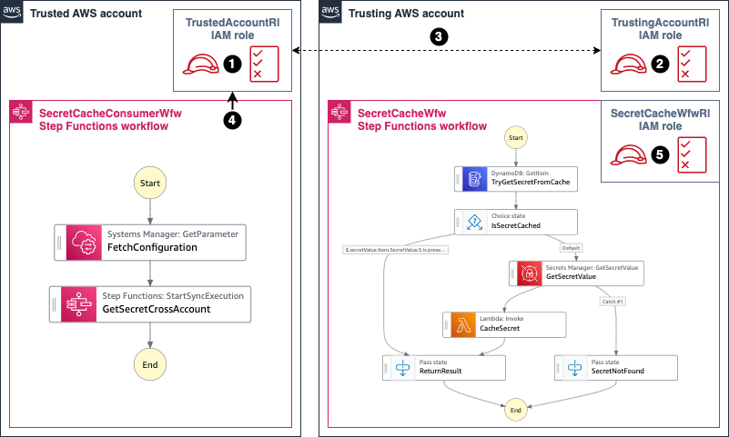
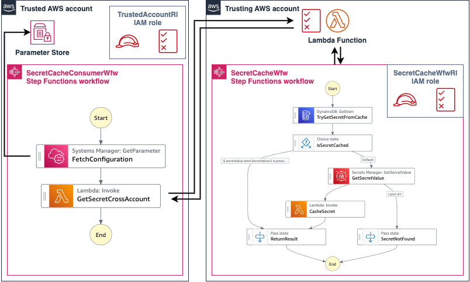

# Introducing cross-account access capabilities for AWS Step Functions

[AWS Step Functions](https://aws.amazon.com/step-functions/) allows you to integrate with more than 220 AWS Services by using [optimized integrations](https://docs.aws.amazon.com/step-functions/latest/dg/connect-supported-services.html) (for services such as [AWS Lambda](https://aws.amazon.com/lambda/)), and [AWS SDK integrations](https://aws.amazon.com/about-aws/whats-new/2021/09/aws-step-functions-200-aws-sdk-integration/). These capabilities provide the ability to build robust solutions using AWS Step Functions as the engine behind the solution.

Many customers are using [multiple AWS accounts](https://docs.aws.amazon.com/whitepapers/latest/organizing-your-aws-environment/organizing-your-aws-environment.pdf) for application development. Until today, customers had to rely on [resource-based policies](https://docs.aws.amazon.com/IAM/latest/UserGuide/reference_aws-services-that-work-with-iam.html) to make cross-account access for Step Functions possible. With resource-based policies, you can specify who has access to the resource and what actions they can perform on it.

Not all AWS services [support resource-based policies](https://docs.aws.amazon.com/IAM/latest/UserGuide/reference_aws-services-that-work-with-iam.html). For example, it is possible to enable cross-account access via resource-based policies with services like [AWS Lambda](https://aws.amazon.com/lambda/), [Amazon SQS](https://aws.amazon.com/sqs/), or [Amazon SNS](https://aws.amazon.com/sns/). However, services such as [Amazon DynamoDB](https://aws.amazon.com/dynamodb/) do not support resource-based policies, so your workflows can only use Step Functions’ direct integration if it belongs to the same account.

Now, customers can take advantage of identity-based policies in Step Functions so your workflow can directly invoke resources in other AWS accounts, thus allowing cross-account service API integrations.

## Overview

This example demonstrates how to use cross-account capability using two AWS accounts:

- A trusted AWS account (account ID `111111111111`) with a Step Functions workflow named `SecretCacheConsumerWfw`, and an IAM role named `TrustedAccountRl`.
- A trusting AWS account (account ID `222222222222`) with a Step Functions workflow named `SecretCacheWfw`, and two IAM roles named `TrustingAccountRl`, and `SecretCacheWfwRl`.


At a high level:

1. The `SecretCacheConsumerWfw` workflow runs under `TrustedAccountRl` role in the account `111111111111`. The `TrustedAccountRl` role has permissions to assume the `TrustingAccountRl` role from the account `222222222222`.
1. The `FetchConfiguration` Step Functions task fetches the `TrustingAccountRl` role ARN, the `SecretCacheWfw` workflow ARN, and the secret ARN (all these resources belong to the `Trusting` AWS account).
1. The `GetSecretCrossAccount` Step Functions task has a `Credentials` field with the `TrustingAccountRl` role ARN specified (fetched in the step 2).
1. The `GetSecretCrossAccount` task assumes the `TrustingAccountRl` role during the `SecretCacheConsumerWfw` workflow execution.
1. The `SecretCacheWfw` workflow (that belongs to the account `222222222222`) is invoked by the `SecretCacheConsumerWfw` workflow under the `TrustingAccountRl` role.
1. The results are returned to the `SecretCacheConsumerWfw` workflow that belongs to the account `111111111111`.

The `SecretCacheConsumerWfw` workflow definition specifies the `Credentials` field and the `RoleArn`. This allows the `GetSecretCrossAccount` step to assume an IAM role that belongs to a separate AWS account:

```json
{
  "StartAt": "FetchConfiguration",
  "States": {
    "FetchConfiguration": {
      "Type": "Task",
      "Next": "GetSecretCrossAccount",
      "Parameters": {
        "Name": "<ConfigurationParameterName>"
      },
      "Resource": "arn:aws:states:::aws-sdk:ssm:getParameter",
      "ResultPath": "$.Configuration",
      "ResultSelector": {
        "Params.$": "States.StringToJson($.Parameter.Value)"
      }
    },
    "GetSecretCrossAccount": {
      "End": true,
      "Type": "Task",
      "ResultSelector": {
        "Secret.$": "States.StringToJson($.Output)"
      },
      "Resource": "arn:aws:states:::aws-sdk:sfn:startSyncExecution",
      "Credentials": {
        "RoleArn.$": "$.Configuration.Params.trustingAccountRoleArn"
      },
      "Parameters": {
        "Input.$": "$.Configuration.Params.secret",
        "StateMachineArn.$": "$.Configuration.Params.trustingAccountWorkflowArn"
      }
    }
  }
}
```

## Permissions



At a high level:

1. The `TrustedAccountRl` role belongs to the account `111111111111`.
1. The `TrustingAccountRl` role belongs to the account `222222222222`.
1. A trust relationship setup between the `TrustedAccountRl` and the `TrustingAccountRl` role.
1. The `SecretCacheConsumerWfw` workflow is executed under the `TrustedAccountRl` role in the account `111111111111`.
1. The `SecretCacheWfw` is executed under the `SecretCacheWfwRl` role in the account `222222222222`.

The `TrustedAccountRl` role (1) has the following trust policy setup that allows the `SecretCacheConsumerWfw` workflow to assume (4) the role.

```json
{
  "RoleName": "<TRUSTED_ACCOUNT_ROLE_NAME>",
  "AssumeRolePolicyDocument": {
    "Version": "2012-10-17",
    "Statement": [
      {
        "Effect": "Allow",
        "Principal": {
          "Service": "states.<REGION>.amazonaws.com"
        },
        "Action": "sts:AssumeRole"
      }
    ]
  }
}
```

The `TrustedAccountRl` role (1) has the following permissions configured that allow it to assume (3) the `TrustingAccountRl` role (2).

```json
{
  "RoleName": "<TRUSTED_ACCOUNT_ROLE_NAME>",
  "PolicyDocument": {
    "Version": "2012-10-17",
    "Statement": [
      {
        "Action": "sts:AssumeRole",
        "Resource": "arn:aws:iam::<TRUSTING_ACCOUNT>:role/<TRUSTING_ACCOUNT_ROLE_NAME>",
        "Effect": "Allow"
      }
    ]
  }
}
```

The `TrustedAccountRl` role (1) has the following permissions setup that allow it to access [Parameter Store](https://docs.aws.amazon.com/systems-manager/latest/userguide/systems-manager-parameter-store.html), a capability of [AWS Systems Manager](https://aws.amazon.com/systems-manager/), and fetch the required configuration.

```json
{
  "RoleName": "<TRUSTED_ACCOUNT_ROLE_NAME>",
  "PolicyDocument": {
    "Version": "2012-10-17",
    "Statement": [
      {
        "Action": [
          "ssm:DescribeParameters",
          "ssm:GetParameter",
          "ssm:GetParameterHistory",
          "ssm:GetParameters"
        ],
        "Resource": "arn:aws:ssm:<REGION>:<TRUSTED_ACCOUNT>:parameter/<CONFIGURATION_PARAM_NAME>",
        "Effect": "Allow"
      }
    ]
  }
}
```

The `TrustingAccountRl` role (2) has the following trust policy that allows it to be assumed (3) by the `TrustedAccountRl` role (1). Notice the `Condition` field setup. This field allows us to further control which account and state machine can assume the `TrustingAccountRl` role, preventing the [confused deputy](https://docs.aws.amazon.com/IAM/latest/UserGuide/confused-deputy.html) problem.

```json
{
  "RoleName": "<TRUSTING_ACCOUNT_ROLE_NAME>",
  "AssumeRolePolicyDocument": {
    "Version": "2012-10-17",
    "Statement": [
      {
        "Effect": "Allow",
        "Principal": {
          "AWS": "arn:aws:iam::<TRUSTED_ACCOUNT>:role/<TRUSTED_ACCOUNT_ROLE_NAME>"
        },
        "Action": "sts:AssumeRole",
        "Condition": {
          "StringEquals": {
            "sts:ExternalId": "arn:aws:states:<REGION>:<TRUSTED_ACCOUNT>:stateMachine:<CACHE_CONSUMER_WORKFLOW_NAME>"
          }
        }
      }
    ]
  }
}
```

The `TrustingAccountRl` role (2) has the following permissions configured that allow it to start Step Functions Express Workflows execution synchronously. This capability is needed because the `SecretCacheWfw` workflow is invoked by the `SecretCacheConsumerWfw` workflow under the `TrustingAccountRl` role via a `StartSyncExecution` API call.

```json
{
  "RoleName": "<TRUSTING_ACCOUNT_ROLE_NAME>",
  "PolicyDocument": {
    "Version": "2012-10-17",
    "Statement": [
      {
        "Action": "states:StartSyncExecution",
        "Resource": "arn:aws:states:<REGION>:<TRUSTING_ACCOUNT>:stateMachine:<SECRET_CACHE_WORKFLOW_NAME>",
        "Effect": "Allow"
      }
    ]
  }
}
```

The `SecretCacheWfw` workflow is running under a separate identity – the `SecretCacheWfwRl` role. This role has the permissions that allow it to get secrets from [AWS Secrets Manager](https://aws.amazon.com/secrets-manager/), read/write to DynamoDB table, and invoke Lambda functions.

```json
{
    "Version": "2012-10-17",
    "Statement": [
        {
            "Action": [
                "secretsmanager:getSecretValue",
            ],
            "Resource": "arn:aws:secretsmanager:<REGION>:<TRUSTING_ACCOUNT>:secret:*",
            "Effect": "Allow"
        },
        {
            "Action": "dynamodb:GetItem",
            "Resource": "arn:aws:dynamodb:<REGION>:<TRUSTING_ACCOUNT>:table/<SECRET_CACHE_DDB_TABLE_NAME>",
            "Effect": "Allow"
        },
        {
            "Action": "lambda:InvokeFunction",
            "Resource": [
              "arn:aws:lambda:<REGION>:<TRUSTING_ACCOUNT>:function:<CACHE_SECRET_FUNCTION_NAME>",
              "arn:aws:lambda:<REGION>:<TRUSTING_ACCOUNT>:function:<CACHE_SECRET_FUNCTION_NAME>:*"
            ],
            "Effect": "Allow"
        }
    ]
}
```

## Comparing with resource-based policies

To implement the solution above using resource-based policies, you must front the `SecretCacheWfw` with a resource that supports resource base policies. You can use Lambda for this purpose. A Lambda function has a resource permissions policy that allows for the access by `SecretCacheConsumerWfw` workflow.

The function proxies the call to the `SecretCacheWfw`, waits for the workflow to finish (synchronous call), and yields the result back to the `SecretCacheConsumerWfw`. However, this approach has a few disadvantages:

- Extra cost: With Lambda you are charged based on the number of requests for your function, and the duration it takes for your code to run.
- Additional code to maintain: The code must take the payload from the `SecretCacheConsumerWfw` workflow and pass it to the `SecretCacheWfw` workflow.
- No out-of-the-box error handling: The code must handle errors correctly, retry the request in case of a transient error, provide the ability to do exponential backoff, and provide a circuit breaker in case of persistent errors. Error handling capabilities are [provided natively by Step Functions](https://docs.aws.amazon.com/step-functions/latest/dg/concepts-error-handling.html).



The identity-based policy permission solution provides multiple advantages over the resource-based policy permission solution in this case.

However, resource-based policy permissions provide some advantages and can be used in conjunction with identity-based policies. Identity-based policies and resource-based policies are both permissions policies and are evaluated together:

- Single point of entry: Resource-based policies are attached to a resource. With resource-based permissions policies, you control what identities that do not belong to your AWS account have access to the resource at the resource level. This allows for easier reasoning about what identity has access to the resource. [AWS Identity and Access Management Access Analyzer](https://docs.aws.amazon.com/IAM/latest/UserGuide/what-is-access-analyzer.html) can help with the identity-based policies, providing an ability to identify resources that are shared with an external identity.
- The principal that accesses a resource via a resource-based policy still works in the trusted account and does not have to give its permissions to receive the cross-account role permissions. In this example, `SecretCacheConsumerWfw` still runs under `TrustedAccountRl` role, and does not need to assume an IAM role in the `Trusting` AWS account to access the Lambda function.

Refer to the [how IAM roles differ from resource-based policies](https://docs.aws.amazon.com/IAM/latest/UserGuide/id_roles_compare-resource-policies.html) article for more information.

## Testing the solution

### Prerequisites

The following prerequisites are required for this walk-through:

1. Two [AWS Accounts](https://aws.amazon.com/free/). To create multiple AWS accounts, you can use [AWS Control Tower](https://aws.amazon.com/controltower/). For instructions, see [AWS Control Tower – Set up & Govern a Multi-Account AWS Environment](https://aws.amazon.com/blogs/aws/aws-control-tower-set-up-govern-a-multi-account-aws-environment/).
1. The [AWS CLI](https://docs.aws.amazon.com/cli/latest/userguide/getting-started-install.html) setup for both AWS accounts.
1. The appropriate [AWS Credentials](https://docs.aws.amazon.com/cli/latest/userguide/cli-configure-files.html) configured for both AWS accounts. For more information, see [Named profiles](https://docs.aws.amazon.com/cli/latest/userguide/cli-configure-profiles.html).
1. [Node.js 16](https://nodejs.org/en/download/), [npm](https://www.npmjs.com/), [Typescript](https://www.typescriptlang.org/), [AWS CDK](https://docs.aws.amazon.com/cdk/v2/guide/work-with-cdk-typescript.html), and [jq](https://stedolan.github.io/jq/download/) installed.
1. [Docker](https://docs.docker.com/get-docker/) installed.

### Solution Walk-through

You can use [AWS Cloud9](https://aws.amazon.com/cloud9/), or your preferred IDE, to deploy the solution. If using AWS Cloud9, make sure it has permissions to deploy to **both** AWS accounts. Refer to the cleanup section of this post for instructions to delete the resources to stop incurring any further charges.

1. Clone the project repository to your local machine.

```zsh
git clone https://github.com/aws-samples/aws-stepfunctions-examples.git
```

2. Navigate to the solution folder.

```zsh
cd aws-stepfunctions-examples/cdk/cross-account-access/cdk/
```

3. Build the source files.

```zsh
../scripts/build-src.sh
../scripts/build-cdk.sh
```

4. Set the environment variables you want to use. Replace the `<PLACEHOLDER>` with corresponding values. Make sure you have [Named profiles](https://docs.aws.amazon.com/cli/latest/userguide/cli-configure-profiles.html) setup for the Trusted and the Trusting AWS accounts.

```zsh
TRUSTED_ACCOUNT_ID='<PLACEHOLDER>' # replace with your trusted account id, for example 111111111111
TRUSTING_ACCOUNT_ID='<PLACEHOLDER>' # replace with your trusting account id, for example 222222222222

REGION='<PLACEHOLDER>' # replace with region where cross account is supported, for example ca-central-1

TRUSTED_ACCOUNT_PROFILE='<PLACEHOLDER>' # replace with your trusted account profile, refer to Named profiles
TRUSTING_ACCOUNT_PROFILE='<PLACEHOLDER>' # replace with your trusting account profile, refer to named profiles

TRUSTED_ACCOUNT_RESOURCES_STACK='trusted-account-resources-stack'
TRUSTING_ACCOUNT_RESOURCES_STACK='trusting-account-resources-stack'
TRUSTED_ACCOUNT_CONFIG_STACK='trusted-account-configuration-stack'
```

5. Bootstrap the `Trusting` AWS account. Refer to [Bootstrapping](https://docs.aws.amazon.com/cdk/v2/guide/bootstrapping.html) for more details.

```zsh
cdk bootstrap aws://$TRUSTING_ACCOUNT_ID/$REGION \
--profile $TRUSTING_ACCOUNT_PROFILE
```

6. Bootstrap the `Trusted` AWS account. Refer to [Bootstrapping](https://docs.aws.amazon.com/cdk/v2/guide/bootstrapping.html) for more details. We are allowing `Trusting` AWS account to deploy to `Trusted` AWS account.

```zsh
# allow trusting account to deploy to trusted account
# arn:aws:iam::aws:policy/AdministratorAccess is the default policy used by CF
cdk bootstrap aws://$TRUSTED_ACCOUNT_ID/$REGION \
--cloudformation-execution-policies "arn:aws:iam::aws:policy/AdministratorAccess" \
--trust $TRUSTING_ACCOUNT_ID \
--profile $TRUSTED_ACCOUNT_PROFILE
```

Two things are important in this command:

- `--trust $TRUSTING_ACCOUNT_ID` allows the `Trusting` AWS account to deploy resources to the `Trusted` AWS account via a deployment role.
- `--cloudformation-execution-policies` controls the permissions that the deployment role has to the `Trusted` account.

7. Deploy the resources. Follow the prompts in the console.

```zsh
# this will deploy all 3 stacks, since trusted-account-configuration-stack depends on the other 2
cdk deploy $TRUSTED_ACCOUNT_CONFIG_STACK \
--context trusted-account-id=$TRUSTED_ACCOUNT_ID \
--context trusting-account-id=$TRUSTING_ACCOUNT_ID \
--context region=$REGION \
--profile $TRUSTING_ACCOUNT_PROFILE
```

> The solution has three stacks. The dependencies between stacks are setup in the following order:
>
> - `trusted-account-resources-stack` is deployed first. It belongs to the `Trusted` AWS account.
> - `trusting-account-resources-stack` depends on the `trusted-account-resources-stack` and should be deployed second. It belongs to the `Trusting` AWS account.
> - `trusted-account-configuration-stack` depends on the `trusting-account-resources-stack`, and on the `trusted-account-resources-stack`, and should be deployed third. It belongs to the `Trusted` AWS account.
>
> Dependencies are setup explicitly, so we only need to deploy `trusted-account-configuration-stack`, and it will deploy the rest three stacks automatically.

8. Store the `SecretCacheConsumerWfw` workflow arn in the console variable.

```zsh
SECRET_CACHE_CONSUMER_WORKFLOW_ARN=$(aws cloudformation describe-stacks \
--stack-name $TRUSTED_ACCOUNT_RESOURCES_STACK \
--query "Stacks[0].Outputs[?OutputKey=='SecretCacheConsumerWfArn'].OutputValue" \
--output text \
--region $REGION \
--profile $TRUSTED_ACCOUNT_PROFILE)
```

9. Execute the `SecretCacheConsumerWfw` workflow.

```zsh
../scripts/execute-workflow.sh \
$TRUSTED_ACCOUNT_PROFILE \
$REGION \
$SECRET_CACHE_CONSUMER_WORKFLOW_ARN | jq
```

Inspect the results.

```json
{
  "Secret": {
    "secretValue": "1234567890ABCDEFGHIJKLMOPQRSTUVWXYZ"
  }
}
```

> Note: if you get `null` in the result, repeat this step.

### Optional Steps

1. Store stack output parameters in the console variables.

```zsh
SECRET_CACHE_WORKFLOW_ARN=$(aws cloudformation describe-stacks \
--stack-name $TRUSTING_ACCOUNT_RESOURCES_STACK \
--query "Stacks[0].Outputs[?OutputKey=='SecretCacheWfArn'].OutputValue" \
--output text \
--region $REGION \
--profile $TRUSTING_ACCOUNT_PROFILE)

TRUSTED_ACCOUNT_ROLE_NAME=$(aws cloudformation describe-stacks \
--stack-name $TRUSTED_ACCOUNT_RESOURCES_STACK \
--query "Stacks[0].Outputs[?OutputKey=='TrustedAccountRoleName'].OutputValue" \
--output text \
--region $REGION \
--profile $TRUSTED_ACCOUNT_PROFILE)

TRUSTING_ACCOUNT_ROLE_NAME=$(aws cloudformation describe-stacks \
--stack-name $TRUSTING_ACCOUNT_RESOURCES_STACK \
--query "Stacks[0].Outputs[?OutputKey=='TrustingAccountRoleName'].OutputValue" \
--output text \
--region $REGION \
--profile $TRUSTING_ACCOUNT_PROFILE)
```

2. Run the command below and inspect the `Trusted` account role and its policies. The command generates files with corresponding names under the `/tmp` folder.

```zsh
../scripts/get-role.sh \
$TRUSTED_ACCOUNT_PROFILE \
$REGION \
$TRUSTED_ACCOUNT_ROLE_NAME

../scripts/get-role-policies.sh \
$TRUSTED_ACCOUNT_PROFILE \
$REGION \
$TRUSTED_ACCOUNT_ROLE_NAME
```

3. Run the command below and inspect the `Trusting` account role and its policies. The command generates files with corresponding names under the `/tmp` folder.

```zsh
../scripts/get-role.sh \
$TRUSTING_ACCOUNT_PROFILE \
$REGION \
$TRUSTING_ACCOUNT_ROLE_NAME

../scripts/get-role-policies.sh \
$TRUSTING_ACCOUNT_PROFILE \
$REGION \
$TRUSTING_ACCOUNT_ROLE_NAME
```

4. Run the command below and inspect the workflows. The command generates files with corresponding names under the `/tmp` folder.

```zsh
../scripts/describe-workflow.sh \
$TRUSTED_ACCOUNT_PROFILE \
$REGION \
$SECRET_CACHE_CONSUMER_WORKFLOW_ARN

../scripts/describe-workflow.sh \
$TRUSTING_ACCOUNT_PROFILE \
$REGION \
$SECRET_CACHE_WORKFLOW_ARN
```

### Cleanup

To clean up the resources provisioned by the solution run the command below. Follow the prompts in the console.

```zsh
# this will destroy all 3 stacks, since trusted-account-resources-stack is the dependency for other 2
cdk destroy $TRUSTED_ACCOUNT_RESOURCES_STACK \
--context trusted-account-id=$TRUSTED_ACCOUNT_ID \
--context trusting-account-id=$TRUSTING_ACCOUNT_ID \
--context region=$REGION \
--profile $TRUSTING_ACCOUNT_PROFILE
```

> The command above should delete all 3 stacks:
>
> 1. `trusted-account-configuration-stack` in the `Trusted` AWS account.
> 1. `trusting-account-resources-stack` in the `Trusting` AWS account.
> 1. `trusted-account-resources-stack` in the `Trusted` AWS account.
>
> Delete the stacks manually (in the order presented above) if the command above fails.

</br>

> **Warning**
> At this point the `Trusting` AWS account is still allowed to deploy to `Trusted` AWS account in the `REGION` where we did the initial [bootstrapping](https://docs.aws.amazon.com/cdk/v2/guide/bootstrapping.html).
> Refer to the [cdk cli: no documentation on removing cross account trust](https://github.com/aws/aws-cdk/issues/22703#issuecomment-1298009080) on how to remove cross-account trust with AWS CDK.
> One option described in the issue above is using a `cdk bootstrap --trust ,` command. **Use the command at your own discretion**.

### Cost considerations

Make sure you follow the cleanup process to avoid any unexpected charges.

## Conclusion

This post demonstrates how to create an [AWS Step Functions](https://aws.amazon.com/step-functions/) Express Workflow in one account and call it from an [AWS Step Functions](https://aws.amazon.com/step-functions/) Standard Workflow in another account using a new `Credentials` capability of [AWS Step Functions](https://aws.amazon.com/step-functions/). It provides an example of a cross-account IAM roles setup that allows for the access. It also provides a walk-through on how to use [AWS CDK](https://aws.amazon.com/cdk/) for [Typescript](https://www.typescriptlang.org/) to deploy the example.

For more serverless learning resources, visit [Serverless Land](https://serverlessland.com/).
