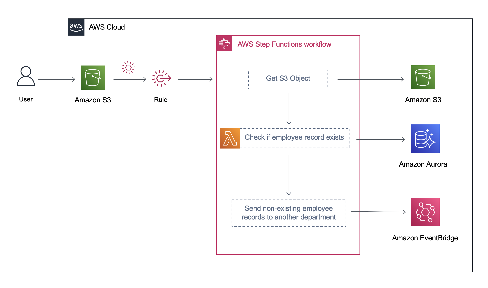

### Sample Step Functions Application

This repository consists of code for a sample state machine application with the below architecture.

##### Deployment Instructions:

The following are per-requisites for running the application

* AWS Account
* AWS CDK
* Java 11 or above
* Maven

Navigate to `software/Lambda` folder inside the local Git repository and execute the following to package the Lambda function. 
`cd software/Lambda` 
`mvn clean package`          

Navigate to `infra` folder in the local git repository and run the following CDK commands.  
`cdk synth`  
`cdk deploy --all`

Note the S3 bucket from the CDK output.
 
#### Trigger State Machine
Upload the sample input file provided in `input` folder to the S3 bucket from above.

#### Cleanup
Navigate to `infra` folder in the local git repository and run the following CDK command  
`cdk destroy --all`