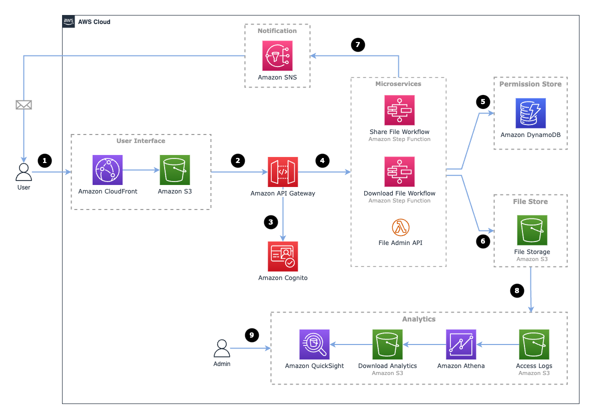

# Serverless File Sharing on AWS

This project is described in the AWS blog post here:
[Enhancing file sharing using Amazon S3 and AWS Step Functions](https://aws.amazon.com/blogs/compute/enhancing-file-sharing-using-amazon-s3-and-aws-step-functions)

## Project structure

The project is split into 2 main code bases:
1. **[CDK Project](/cdk)** -  An AWS CDK (Cloud Development Kit) project which deploys the infrastructure and back end
2. **[UI Project](/ui)** - A React single page app which provides the user interface (UI)

## Getting started

From the main project directory:

1. ```npm install``` - install all dependencies
2. ```npm run build``` - build the UI project
3. ```npm run deploy``` - deploy the project to AWS

Once the project has been deployed, look for an output parameter in your CloudFormation stack called ```WebsiteUrl```. Open this URL in your browser to access the application.

### Running the project locally

To run the UI locally, you can use ```npm run start```.

### Removing the project

To remove the project from AWS, use ```npm run destroy```.

## Overview

This project creates an application on AWS which allows file owners and recipients to share and receive files.

<div style="align: center">


<sub>*Figure 1: High level overview of the project*</sub>
</div>


1. The file owner logs into the application and uploads a file and elects to share their file with 1 or more recipients.

2. Uploaded files are stored in an Amazon S3 bucket managed by the application.

3. The application sends a notification to the recipients which includes a download link and instructions to access their file.

4. The recipient accesses the download link. The link will authenticate the user using their email address and check if the recipient is authorised to download the file before serving it to the recipient. 

## The Architecture

The architecture of the application is made up of a number of serverless AWS services as shown in the diagram below.

<div style="align: center">


<sub>*Figure 2: Architecture of the application*</sub>
</div>

## User Interface

The user interface is deployed as part of the CDK stack. For details on how to run the interface locally, [click here](ui/README.md).

## Analytics

To setup the QuickSight dashboard, [click here](docs/Analytics.md).

## License Summary

This sample code is made available under the MIT-0 license. See the LICENSE file.

## Disclaimer

Sample code, software libraries, command line tools, proofs of concept, templates, or other related technology are provided as AWS Content or Third-Party Content under the AWS Customer Agreement, or the relevant written agreement between you and AWS (whichever applies). You should not use this AWS Content or Third-Party Content in your production accounts, or on production or other critical data. You are responsible for testing, securing, and optimizing the AWS Content or Third-Party Content, such as sample code, as appropriate for production grade use based on your specific quality control practices and standards. Deploying AWS Content or Third-Party Content may incur AWS charges for creating or using AWS chargeable resources, such as running Amazon EC2 instances or using Amazon S3 storage.
