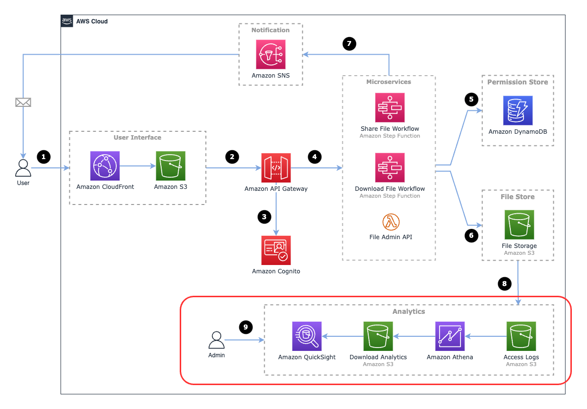
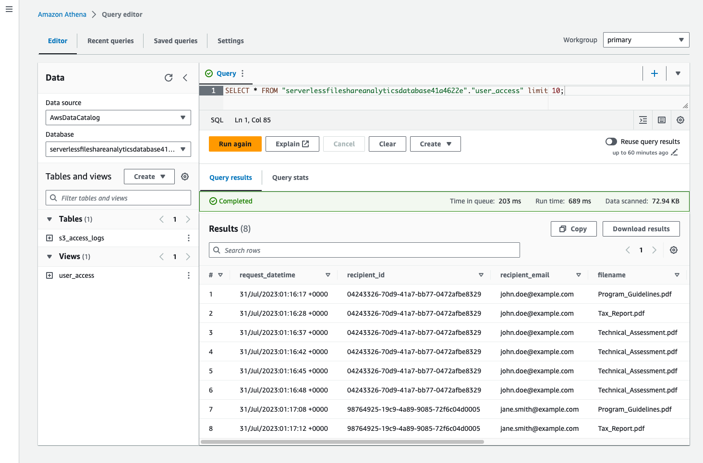
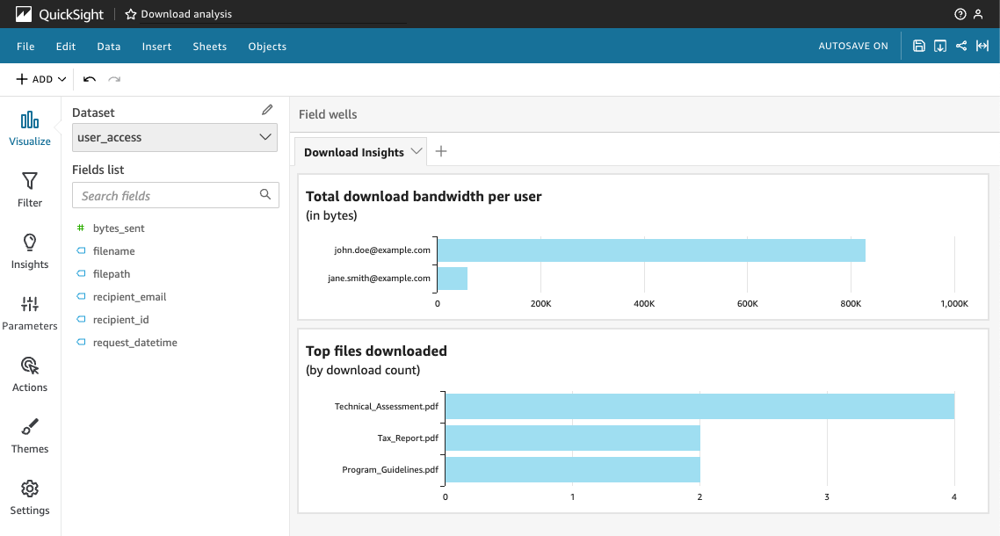
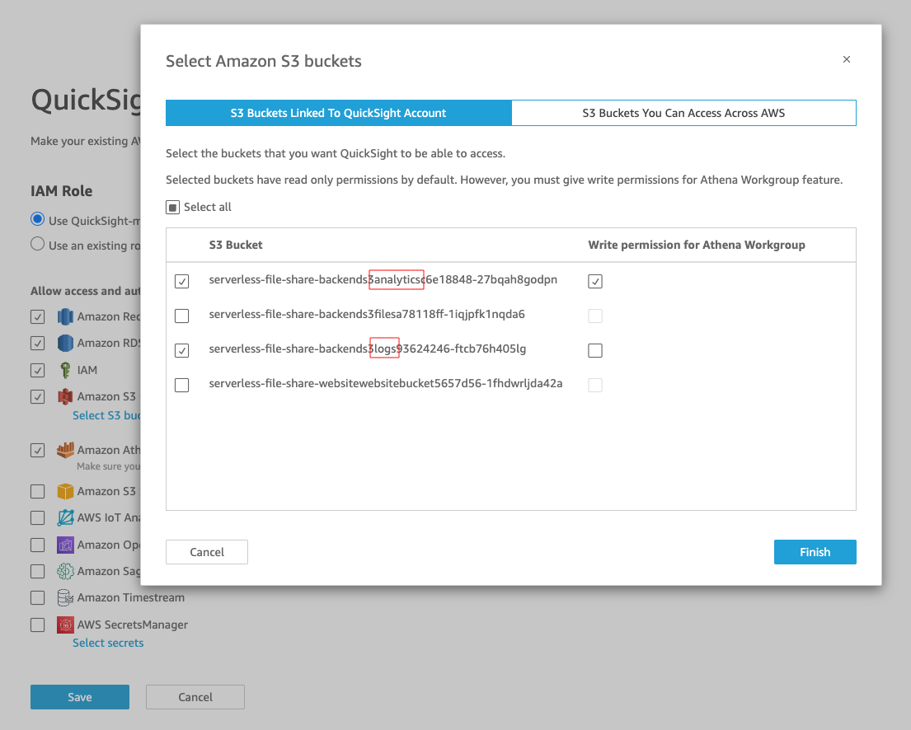
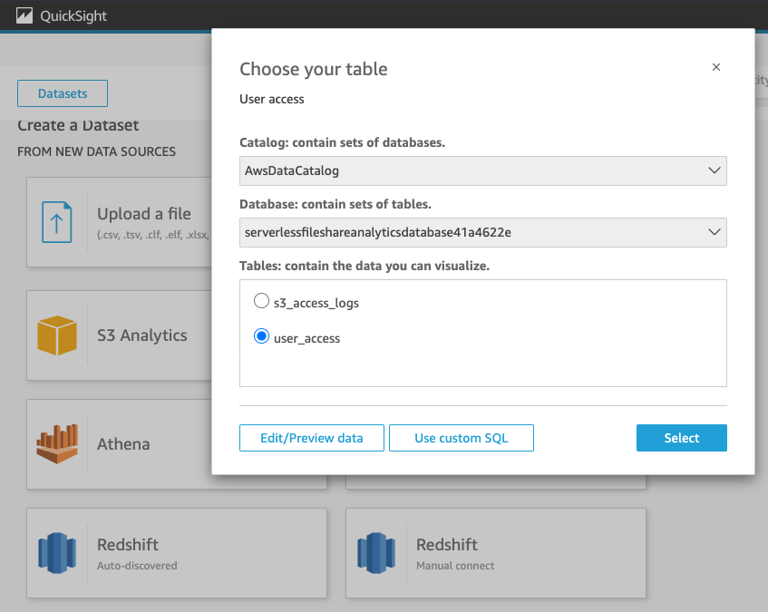

# Analytics

The Serverless File Share solution includes an analytics pipeline to allow administrative users the ability to gain insights into download activity.

*Figure 1: Overall architecture with analytics pipeline highlighted*

## How it works

1. The file store S3 bucket has [S3 access logs](https://docs.aws.amazon.com/AmazonS3/latest/userguide/ServerLogs.html) enabled.
2. Whenever an operation such as GET or PUT is performed on the file S3 bucket, this is automatically logged to another S3 bucket (Access Logs bucket).
3. The solution includes a view in Amazon Athena that can query these logs using a SQL query. This query produces a simple list of which files have been downloaded and how much bandwidth has been consumed.

*Figure 2: Athena view which extracts download requests from S3 access logs*

4. Amazon QuickSight can be used to query the Athena view and provide visualisations and dashboards to administrative users.

*Figure 3: Example of a visualisations using Amazon QuickSight*

---

## How to set up Amazon QuickSight

#### Step 1 - Set up QuickSight permissions 

1. Sign up for QuickSight in the AWS console (if you have not already).
2. Once QuickSight has been enabled, click on the user icon in the top right of the QuickSight console and select **Manage QuickSight**.
3. In the left hand menu, select **Security & Permissions** and click **Manage**.
4. Enable **Amazon S3** and click on **Select S3 buckets**.
5. Select the following buckets:

*Figure 4: S3 permissions in QuickSight*

Look for the buckets which contain the words "analytics" and "logs".

#### Step 2 - Set up an Athena dataset

1. Go back to the QuickSight home page.
2. In the left hand menu, select **Datasets** and click on **New dataset**.
3. Select **Athena** and select the "user_access" view as shown below:

Congratulations, you have now configured QuickSight to query data using S3 access logs and Athena. You can now start creating dashboards and visualisations using QuickSight. For more guidance, check the [Amazon QuickSight User Guide](https://docs.aws.amazon.com/quicksight/latest/user/welcome.html).