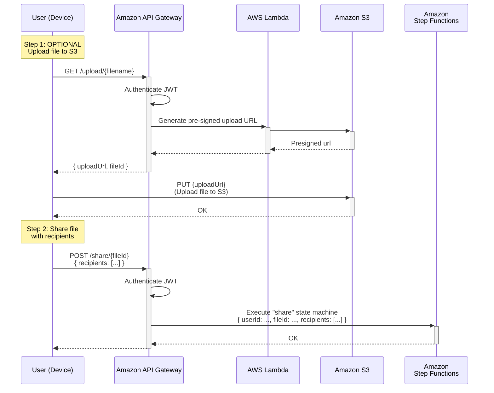

```mermaid
sequenceDiagram

participant user as User (Device)
participant api as Amazon API Gateway
participant lambda as AWS Lambda
participant s3 as Amazon S3
participant sf as Amazon<br />Step Functions

note over user:Step 1: OPTIONAL<br />Upload file to S3
user->>+api:GET /upload/{filename}
api->>api:Authenticate JWT
api->>+lambda:Generate pre-signed upload URL
lambda->>+s3: 
s3-->>-lambda: Presigned url
lambda-->>-api: 
api-->>-user:{ uploadUrl, fileId }

user->>+s3:PUT {uploadUrl}<br />(Upload file to S3)
s3-->>-user:OK

note over user:Step 2: Share file<br />with recipients
user->>+api:POST /share/{fileId}<br />{ recipients: [...] }
api->>api:Authenticate JWT
api->>+sf:Execute "share" state machine<br />{ userId: ..., fileId: ..., recipients: [...] }
sf-->>-api:OK
api-->>-user: 
```
