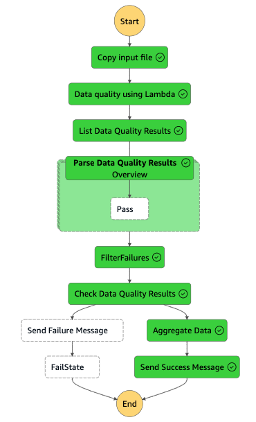

# Building a data pipeline with data quality checks using AWS Lambda

This project contains source code and supporting files for a serverless data quality application that you can deploy with the SAM CLI. It includes the following files and folders.

- deequ-on-lambda - Code for the application's Lambda function running deequ on spark to perform data quality checks and Project Dockerfile.
- aggregate_function - Code for the application's Lambda function aggregating the results of the good file that came out of data quality check.
- copy-input-file - Code for the application's Lambda function copying input data file.
- cloudformation - A template for generating the ECR image of the [Spark on AWS Lambda framework](https://github.com/aws-samples/spark-on-aws-lambda) (SoAL framework). 
- template.yaml - A template that defines the application's AWS resources including step functions.

The application uses several AWS resources, including AWS Lambda functions, AWS Step Functions, Amazon S3 buckets and Amazon SNS. These resources are defined in the `template.yaml` file in this project. The sample is focused on data quality checks using PyDeequ library within the SoAL framework on AWS Lambda. Attention is drawn to a publicly accessible file, rich with details on rental properties, to highlight the essential process of conducting data quality checks before proceeding with data processing. The demonstration serves as an illustration of how AWS Lambda can be utilized for scalable and efficient data quality management, suitable for enterprises and organizations. By integrating PyDeequ, a library that operates atop Apache Spark for establishing and executing data quality checks, with the serverless computing capabilities provided by AWS Lambda, a novel approach to ensuring data integrity is demonstrated.



## Deploy the sample application
1. Clone the github repository.
1. This sample application has been tested in us-east-1 region.
1. Create a ECR image for running Spark on AWS Lambda (SoAL Framework) - 
    1. Navigate to the CloudFormation service on your AWS Console. Create a stack with new resources. Upload cfn-imagebuilder.yaml file from cloudformation folder in the cloned repository. Provide a stack name. ex: deequ-image-builder. Leave rest as defaults on all pages until you reach the Submit page. Review the checkboxes and click on *Submit*.
    1. Once the cloudformation stack is completed, navigate to CodeBuild service on AWS Console. Make sure that CodeBuild has successfully built the ECR image. If it failed due to toomanyrequests while pulling base image from dockerhub, you can push *Retry build* button on CodeBuild console.
    1. Navigate to CloudFormation service and open the stack you just created. Go to the *Outputs* tab and copy the *ImageUri* and save it somewhere. It will be needed in further steps.
2. Use sam cli to build and deploy the data quality pipeline to your AWS Account

    The Serverless Application Model Command Line Interface (SAM CLI) is an extension of the AWS CLI that adds functionality for building and testing Lambda applications. It uses Docker to run your functions in an Amazon Linux environment that matches Lambda. It can also emulate your application's build environment and API.

    To use the SAM CLI, you need the following tools.

    * SAM CLI - [Install the SAM CLI](https://docs.aws.amazon.com/serverless-application-model/latest/developerguide/serverless-sam-cli-install.html)
    * Docker - [Install Docker community edition](https://hub.docker.com/search/?type=edition&offering=community)

    You may need the following for local testing.
    * [Python 3 installed](https://www.python.org/downloads/)

3. To build and deploy your application for the first time, run the following in your shell from the root of your cloned project app-dataquality-using-lambda:

    ```bash
    sam build
    sam deploy --guided
    ```
    
    The first command will build a docker image from a Dockerfile and then copy the source of your application inside the Docker image. The second command will package and deploy your application to AWS, with a series of prompts:

    * **Stack Name**: The name of the stack to deploy to CloudFormation. This should be unique to your account and region, and a good starting point would be something matching your project name.
    * **AWS Region**: The AWS region you want to deploy your app to.
    * **Parameter ImageUri**: Paste the ImageUri that you copied earlier.
    * **Parameter SparkScript**: Press enter to accept the default value.
    * **Parameter InputPath**: Press enter to accept the default value.
    * **Confirm changes before deploy**: If set to yes, any change sets will be shown to you before execution for manual review. If set to no, the AWS SAM CLI will automatically deploy application changes.
    * **Allow SAM CLI IAM role creation**: Many AWS SAM templates, including this example, create AWS IAM roles required for the AWS Lambda function(s) included to access AWS services. By default, these are scoped down to minimum required permissions. To deploy an AWS CloudFormation stack which creates or modifies IAM roles, the `CAPABILITY_IAM` value for `capabilities` must be provided. If permission isn't provided through this prompt, to deploy this example you must explicitly pass `--capabilities CAPABILITY_IAM` to the `sam deploy` command.
    * **Save arguments to samconfig.toml**: If set to yes, your choices will be saved to a configuration file inside the project, so that in the future you can just re-run `sam deploy` without parameters to deploy changes to your application.


## Running the sample application
* Once the application is deployed successfully to your AWS account, navigate to S3 buckets and you should see a new bucket created with the prefix as your stack name. Upload deequ-on-lambda/dataquality-check-function.py file from this repository to the bucket. This will be the spark script that will run deequ and perform data quality checks.
* Navigate to new SNS topic created with your stackname as prefix. [Subscribe](https://docs.aws.amazon.com/sns/latest/dg/sns-email-notifications.html) with your email so that you can receive the email at the end of the step functions execution. Make sure to confirm subscription on the email.
* Navigate to Step Functions on AWS console and you should be able to see the state machine with prefix DataQualityUsingLambdaStateMachine.
* Start the execution of the state machine by selecting *Start execution* 
* This will start the state machine which will first perform the data quality check and if it passes it will aggregate the results by neighbourhood_group and send aggregated results to S3 bucket and send the success notification to the user via the SNS topic. 
* If you open, deequ-on-lambda/dataquality-check-function.py file, you will notice below checks being performed on the file. As you can see, for name and host_name, it's checking whether > 99% of the records in the input file have host_name and name populated.
       ```
        checkResult = VerificationSuite(spark) \
        .onData(dataset) \
        .addCheck(
            check.hasSize(lambda x: x >= 22248) \
            .hasCompleteness("name", lambda x: x >= 0.99)  \
            #.isComplete("name")  \
            .isUnique("id")  \
            .hasCompleteness("host_name", lambda x: x >= 0.99)  \
            #.isComplete("host_name")  \
            .isComplete("neighbourhood")  \
            .isComplete("price")  \
            .isNonNegative("price")) \
        .run()
        ```
* In order to test failure scenario, you can comment out hasCompleteness check on name and host_name and uncomment isComplete check on name and host_name. You can now upload the updated dataquality-check-function.py to the S3 bucket and start the step function again with default parameters. There are some records in the file which doesn't have these fields populated. Hence the quality check will fail. If you have subscribed to the SNS topic, you will receive a failure email with the constraints that failed.

## Review the quality check results and metrics
To review the quality check results, you can navigate to the same S3 bucket. Navigate to the OUTPUT/verification-results folder to see the quality check verification results. Open the file name starting with the prefix part. The following table is a snapshot of the file for the success scenario.

|check	|check_level	|check_status	|constraint	|constraint_status|
|-----  |-----------    |------------   |---------- |-----------------|
|Accomodations	|Error|	Success|	SizeConstraint(Size(None))	|Success|
|Accomodations	|Error	|Success|	CompletenessConstraint(Completeness(name,None))	|Success|
|Accomodations	|Error	|Success|	UniquenessConstraint(Uniqueness(List(id),None))	|Success|
|Accomodations	|Error	|Success	|CompletenessConstraint(Completeness(host_name,None))	|Success|
|Accomodations	|Error|	Success	|CompletenessConstraint(Completeness(neighbourhood,None))	|Success|
|Accomodations	|Error	|Success	|CompletenessConstraint(Completeness(price,None))	|Success|

Check_status suggests if the quality check was successful or a failure. The Constraint column suggests the different quality checks that were done by the Deequ engine. Constraint_status suggests the success or failure for each of the constraint.

You can also review the quality check metrics generated by Deequ by navigating to the folder OUTPUT/verification-results-metrics. Open the file name starting with the prefix part. The following table is a snapshot of the file for success scenario.

|entity	|instance	|name	|value|
|------ |--------   |----   |-----|
|Column	|price is non-negative	|Compliance|	1|
|Column	|neighbourhood	|Completeness	|1|
|Column	|price	|Completeness	|1|
|Column	|id	|Uniqueness	|1|
|Column	|host_name	|Completeness|	0.998831356|
|Column	|name	|Completeness	|0.997348076|

## Cleanup

To delete the sample application that you created, use the AWS CLI. Assuming you used your project name for the stack name, you can run the following:

```bash
sam delete --stack-name "dataquality-using-lambda"
```
To delete the ECR image you created using CloudFormation, delete the stack from the CloudFormation service.

## Resources

See the [AWS SAM developer guide](https://docs.aws.amazon.com/serverless-application-model/latest/developerguide/what-is-sam.html) for an introduction to SAM specification, the SAM CLI, and serverless application concepts.

Next, you can use AWS Serverless Application Repository to deploy ready to use Apps that go beyond hello world samples and learn how authors developed their applications: [AWS Serverless Application Repository main page](https://aws.amazon.com/serverless/serverlessrepo/)
