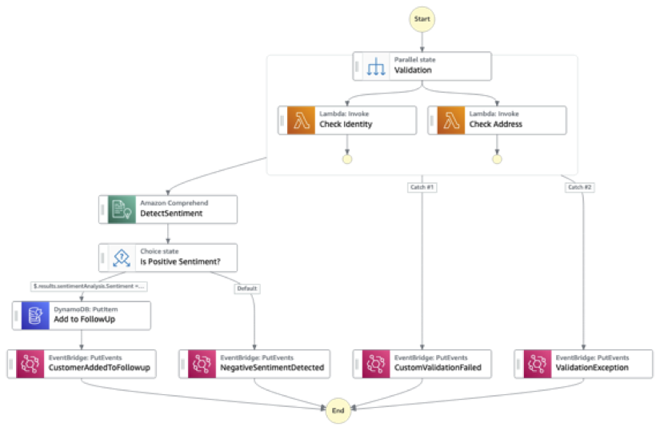
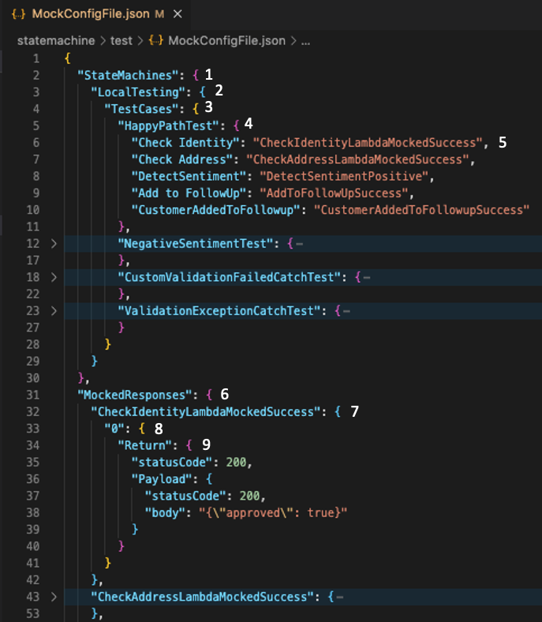
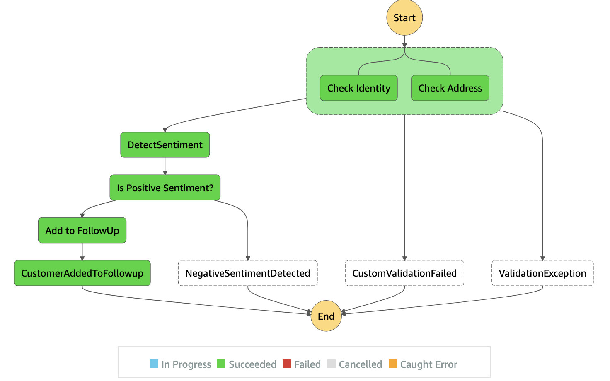
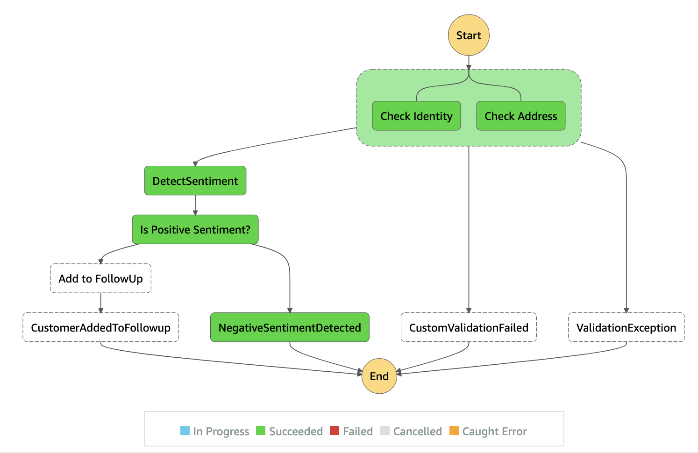
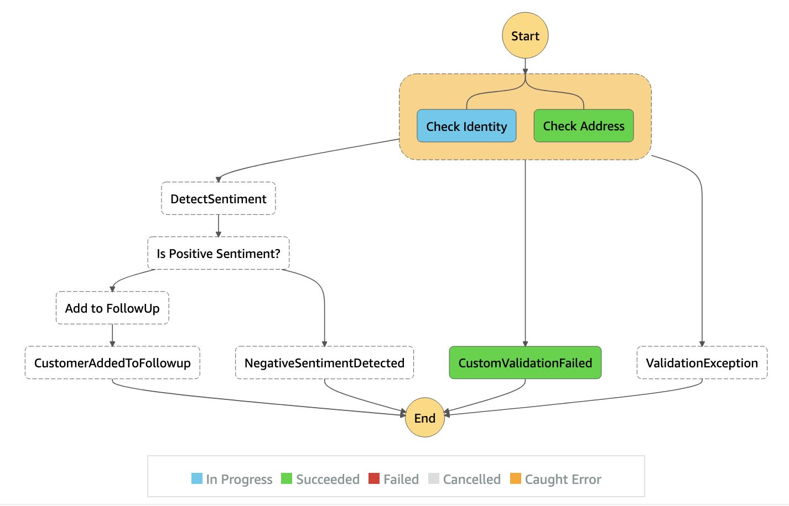
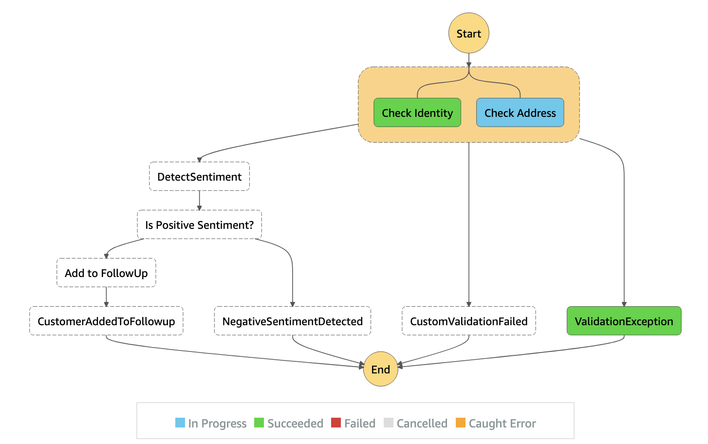
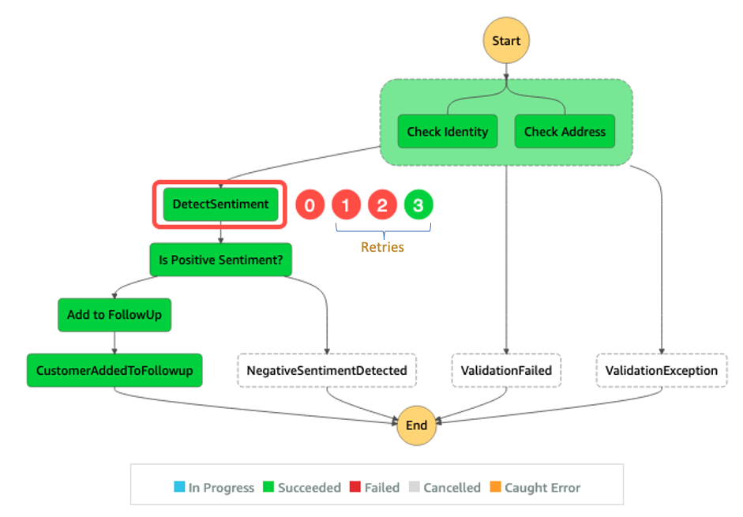

# AWS Step Functions Local Testing with mocking

This is a sample application which showcases how to use Step Functions local testing using mock configs. Using mock config allows a developer to mock the output of service integrations that are present in a state machine.

Developers can provide a valid sample output from the service call API that is present in the state machine as mock data. This allows developers to test the behavior of the state machine in isolation.

Multiple testing scenarios can be handled in a `MockConfigFile.json`. Let's dive deeper to understand how it works.

## Overview of State Machine



In this example, new sales leads are created in a customer relationship management system, triggering the sample workflow execution using input data as shown below, which provides information about the contact’s identity, address, and a free-form comment field.

```json
{
  "data": {
    "firstname": "Jane",
    "lastname": "Doe",
    "identity": {
      "email": "jdoe@example.com",
      "ssn": "123-45-6789"
    },
    "address": {
      "street": "123 Main St",
      "city": "Columbus",
      "state": "OH",
      "zip": "43219"
    },
    "comments": "I am glad to sign-up for this service. Looking forward to different options."
  }
}
```

Using the sales lead data, the workflow first validates the contact’s identity and address. If valid, it uses the Step Function’s AWS SDK Integration for Amazon Comprehend to call the `DetectSentiment` API using the sales lead’s comments as input for sentiment analysis. If the comments have a positive sentiment, the sales leads information is added to a DynamoDB for follow up and an event is published to Amazon EventBridge to notify subscribers. If the sales lead data is invalid or a negative sentiment is detected, events are published to EventBridge for notification, but no record is added to the Amazon DynamoDB table

## Use Step Functions Local Mock Config
The goal of Step Functions mock config is to test the above state machine in isolation without the need of actual AWS services integration. For this, Step Functions local uses `MockConfigFile.json` and it has the following structure:



1. Mock Configurations for your state machines
2. Name of the State Machine under test
3. The number of test cases per the surrounding state machine that is under test
4. Name of the test case
5. Mapping of State (string match) with the supplied mock response
6. Mock responses used by all of the state machines under test
7. Mock Response string matching the value from #5
8. Mock response for the first invocation of that state. Subsequent invocations can be referred as "1", "2", and so on. In case of retries, it can be referred as "0-2" (for 3 failed retries) and another json object with key "3" mocking the successful response. This is assuming that the state machine state has Retry block with `MaxAttempts` set to 3
9. Return the mock response that matches the expected response from the task (response is not validated by Step Functions Local)

### Prerequisites

You will need below items to successfully test and deploy:

 - [AWS CLI](https://aws.amazon.com/cli/)
 - [AWS SAM CLI](https://docs.aws.amazon.com/serverless-application-model/latest/developerguide/serverless-sam-cli-install.html)
 - [Docker](https://docs.docker.com/get-docker/)


### Running Local tests with mock

After cloning this repository, `cd` to it's root directory:

```bash
cd app-local-testing-mock-config
```

Following the user guide, you can either run Step Functions local [as a JAR](https://docs.aws.amazon.com/step-functions/latest/dg/sfn-local-computer.html) or as a [Docker container](https://docs.aws.amazon.com/step-functions/latest/dg/sfn-local-docker.html). Steps below will focus on the docker container approach.

Following the user guide for Step Functions local testing using docker container, pull the latest docker image as:

```bash
docker pull amazon/aws-stepfunctions-local
```

Running the container image:

```bash
docker run -p 8083:8083 \
  --mount type=bind,readonly,source=$(pwd)/statemachine/test/MockConfigFile.json,destination=/home/StepFunctionsLocal/MockConfigFile.json \
  -e SFN_MOCK_CONFIG="/home/StepFunctionsLocal/MockConfigFile.json" \
  amazon/aws-stepfunctions-local
```

### Testing the application

Create the state machine in State Functions local:

```bash
aws stepfunctions create-state-machine \
  --endpoint-url http://localhost:8083 \
  --definition file://statemachine/local_testing.asl.json \
  --name "LocalTesting" \
  --role-arn "arn:aws:iam::123456789012:role/DummyRole"
```

#### Happy Path Scenario

Trying to execute happy path where no error is faced. Note that the below CLI command appends the test case `#HappyPathTest` to state machine ARN. This name matches with the test case name provided in `MockConfigFile.json`



```bash
aws stepfunctions start-execution \
  --endpoint http://localhost:8083 \
  --name executionWithHappyPathMockedServices \
  --state-machine arn:aws:states:us-east-1:123456789012:stateMachine:LocalTesting#HappyPathTest \
  --input file://events/sfn_valid_input.json
```

**Validate Results**
To validate the HappyPathTest test case, we want to verify that a TaskStateExited event exists for a task named *CustomerAddedToFollowup*, which can be confirmed using the following command.

```bash
aws stepfunctions get-execution-history \
  --endpoint http://localhost:8083 \
  --execution-arn arn:aws:states:us-east-1:123456789012:execution:LocalTesting:executionWithHappyPathMockedServices \
  --query 'events[?type==`TaskStateExited` && stateExitedEventDetails.name==`CustomerAddedToFollowup`]'
```

The command result confirms that the workflow execution successfully exited the *CustomerAddedToFollowup* task.

```json
[
  {
    "timestamp": "2022-01-13T09:22:06.422000-05:00",
    "type": "TaskStateExited",
    "id": 32,
    "previousEventId": 31,
    "stateExitedEventDetails": {
      "name": "CustomerAddedToFollowup",
      "output": "{\"statusCode\":200,\"Payload\":{\"statusCode\":200}}",
      "outputDetails": {
        "truncated": false
      }
    }
  }
]
```

**Negative Sentiment Scenario**



```bash
aws stepfunctions start-execution \
  --endpoint http://localhost:8083 \
  --name executionWithNegativeSentimentMockedServices \
  --state-machine arn:aws:states:us-east-1:123456789012:stateMachine:LocalTesting#NegativeSentimentTest \
  --input file://events/sfn_valid_input.json
```

#### Error Scenario Testing

**Custom Validation Error Scenario**



```bash
aws stepfunctions start-execution \
  --endpoint http://localhost:8083 \
  --name executionWithCatchCustomErrorPathMockedServices \
  --state-machine arn:aws:states:us-east-1:123456789012:stateMachine:LocalTesting#CustomValidationFailedCatchTest \
  --input file://events/sfn_valid_input.json
```

**Exception Path**



```bash
aws stepfunctions start-execution \
  --endpoint http://localhost:8083 \
  --name executionWithCatchRuntimeExceptionPathMockedServices \
  --state-machine arn:aws:states:us-east-1:123456789012:stateMachine:LocalTesting#ValidationExceptionCatchTest \
  --input "$(cat ./events/sfn_valid_input.json)"
```

You can check the execution history by running the command:

```bash
aws stepfunctions get-execution-history \
  --endpoint http://localhost:8083 \
  --execution-arn arn:aws:states:us-east-1:123456789012:execution:LocalTesting:executionWithCatchRuntimeExceptionPathMockedServices
```

#### Retry on Service error with success
In this last test case, we’ll return to the HappyPath use case in which both validation steps are successful and a positive sentiment is detected, however this time we want to test that the retry configuration on the *DetectSentiment* task works correctly if there are temporary issues communicating with the Comprehend's `DetectSentiment` API.  We can simulate this scenario by returning failed mock responses for the first three attempts to communicate with the Comprehend API and a successful mock response for the fourth attempts. The execution path for this test scenario is illustrated in the diagram below (the red and green numbers have been added). 0 represents the first execution of state, whereas 1, 2, and 3 represent the max retry attempts (`MaxAttempts`) in case of an `InternalServerException` from `DetectSentiment` API




The portion of `MockedResponses` that is important to focus here is:

```json
"DetectSentimentRetryOnErrorWithSuccess": {
  "0-2": {
    "Throw": {
      "Error": "InternalServerException",
      "Cause": "Server Exception while calling DetectSentiment API in Comprehend Service"
    }
  },
  "3": {
    "Return": {
      "Sentiment": "POSITIVE",
      "SentimentScore": {
        "Mixed": 0.00012647535,
        "Negative": 0.00008031699,
        "Neutral": 0.0051454515,
        "Positive": 0.9946478
      }
    }
  }
}
```

Now, run the corresponding test:

```bash
aws stepfunctions start-execution \
  --endpoint http://localhost:8083 \
  --name retryTestExecution \
  --state-machine arn:aws:states:us-east-1:123456789012:stateMachine:LocalTesting#RetryOnServiceExceptionTest \
  --input file://events/sfn_valid_input.json
```

followed by validating the execution history:

```bash
aws stepfunctions get-execution-history \
  --endpoint http://localhost:8083 \
  --execution-arn arn:aws:states:us-east-1:123456789012:execution:LocalTesting:retryTestExecution \
  --query 'events[?(type==`TaskFailed` && taskFailedEventDetails.error==`InternalServerException`) || (type==`TaskSucceeded` && taskSucceededEventDetails.resource==`comprehend:detectSentiment`)]'
```

Above command should show the results highlighting 3 failed attempts with a final successful service call:

```json
[
  {
    "timestamp": "2022-01-25T17:24:32.276000-05:00",
    "type": "TaskFailed",
    "id": 19,
    "previousEventId": 18,
    "taskFailedEventDetails": {
      "error": "InternalServerException",
      "cause": "Server Exception while calling DetectSentiment API in Comprehend Service"
    }
  },
  {
    "timestamp": "2022-01-25T17:24:33.286000-05:00",
    "type": "TaskFailed",
    "id": 22,
    "previousEventId": 21,
    "taskFailedEventDetails": {
      "error": "InternalServerException",
      "cause": "Server Exception while calling DetectSentiment API in Comprehend Service"
    }
  },
  {
    "timestamp": "2022-01-25T17:24:34.291000-05:00",
    "type": "TaskFailed",
    "id": 25,
    "previousEventId": 24,
    "taskFailedEventDetails": {
      "error": "InternalServerException",
      "cause": "Server Exception while calling DetectSentiment API in Comprehend Service"
    }
  },
  {
    "timestamp": "2022-01-25T17:24:35.301000-05:00",
    "type": "TaskSucceeded",
    "id": 28,
    "previousEventId": 27,
    "taskSucceededEventDetails": {
      "resourceType": "aws-sdk",
      "resource": "comprehend:detectSentiment",
      "output": "{\"data\":{\"firstname\":\"Jane\",\"lastname\":\"Doe\",\"identity\":{\"email\":\"jdoe@example.com\",\"ssn\":\"123-45-6789\"},\"address\":{\"street\":\"123 Main St\",\"city\":\"Columbus\",\"state\":\"OH\",\"zip\":\"43219\"},\"comments\":\"I am glad to sign-up for this service. Looking forward to different options.\"},\"results\":{\"sentimentAnalysis\":{\"Sentiment\":\"POSITIVE\",\"SentimentScore\":{\"Mixed\":1.2647535E-4,\"Negative\":8.031699E-5,\"Neutral\":0.0051454515,\"Positive\":0.9946478}}}}",
      "outputDetails": {
        "truncated": false
      }
    }
  }
]
```

## Running all tests with few commands
This sample application also provides a `makefile` which has all the required commands to run docker [`make run`], create state machine and execute tests [`make all`], and checking history [`make history`].

On a terminal window, first start with running docker:

```bash
make run
```

On a different terminal window/tab, you can then run:

```bash
make all
```

Finally, you can check history of each execution by running:

```bash
make history
```

Check [`makefile`](./makefile) for details

## Deploy the sample application
Step Functions Local with mock config provides a way to test a state machine in isolation. However, once testing is complete, state machine should show the same behavior as the tests when deployed in an AWS account and integrated with other AWS services. 

You can deploy the sample application in AWS account, start the execution of Step Function, and verify the execution history. It should match with the execution history shown in tests.

Deploy this sample application in your AWS account in order to test the state machine from console. Run:

```bash
sam build && sam deploy --guided
```

For subsequent build and deploys:

```bash
sam build && sam deploy
```

To run the happy path scenario of the application using the AWS CLI, replace the state machine ARN from the output of the deployment steps:

```bash
aws stepfunctions start-execution \
  --state-machine <StepFunctionArnHere> \
  --input file://events/sfn_valid_input.json
```

You should see an output like:

```json
{
  "executionArn": "arn:aws:states:us-east-1:123456789012:execution:LocalTestingStateMachine-asdf1234:2c9e4676-b2f6-4e80-994b-7611c4b4418d",
  "startDate": "2022-01-13T16:29:47.471000-05:00"
}
```

Now verify the output from the history of the execution, similar to verification done in local testing:

```bash
aws stepfunctions get-execution-history \
  --execution-arn <ExecutionArnFromPreviousOutput> \
  --query 'events[?type==`TaskStateExited` && stateExitedEventDetails.name==`CustomerAddedToFollowup`]'
```

should give result as:

```json
[
  {
    "timestamp": "2022-01-13T16:29:48.521000-05:00",
    "type": "TaskStateExited",
    "id": 32,
    "previousEventId": 31,
    "stateExitedEventDetails": {
      "name": "CustomerAddedToFollowup",
      "output": "{\"Entries\":[{\"EventId\":\"6e9bf7b4-13e2-097d-7555-f38cb7af12se\"}],\"FailedEntryCount\":0}",
      "outputDetails": {
        "truncated": false
      }
    }
  }
]
```

## Cleanup
To cleanup the infrastructure:

```bash
sam delete
```