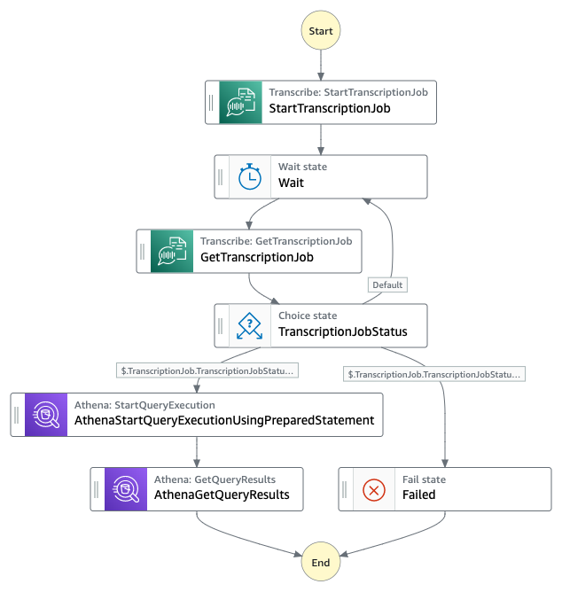
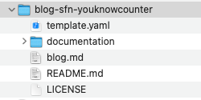
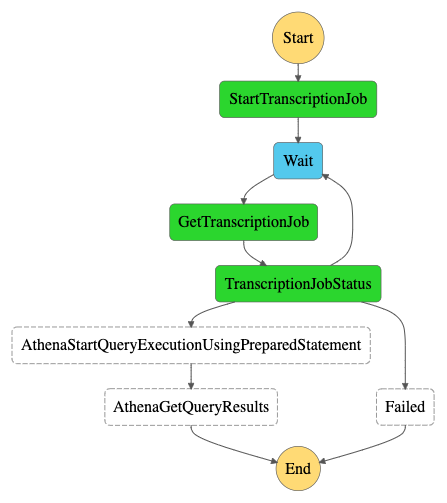
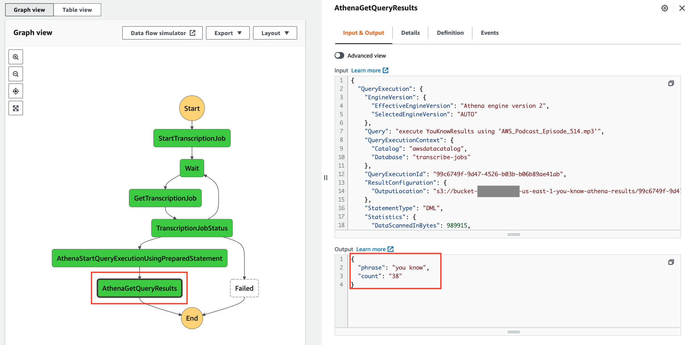

# blog-sfn-youknowcounter

## Building A Low-Code You Know Counter

### Description

Public speaking provides many opportunities for personal fulfillment and career advancement.
It is important not to develop habits such as using filler words while speaking.
Filler phrases can distract the audience and reduce the value and impact of what you are telling them.

Reviewing recordings of presentations can be helpful in determining if filler phrases are being inadvertently used by the presenter.
Instead of the laborious process of reviewing prior recordings, automation can be used to process media files and perform a speech-to-text function.
That text can then be processed to report on the use of filler phrases.

In this blog, I explain how AWS Step Functions, Amazon Transcribe and Amazon Athena can be used to report on the use of the common phrase "you know" in media files.

AWS Step Functions is a service that can be used to automate and chain together multiple activities and other Amazon services.
Amazon Transcribe is a speech to text service that will use media files as input and produce textual transcripts from them.
Amazon Athena is a service that enables the use of standard SQL to query data in Amazon S3.

Those services can be used to automate and decrease the time required to find the use of filler phrases.

This blog will also demonstrate how a *low-code* approach to implementing this tool can be used.
Low-code is when little or even no software is written to perform a function.
Instead, components are configured and tied together using existing APIs or interfaces.
The AWS Step Functions service provides the ability to tie actions together and an SDK in it is used to perform Amazon service API calls by using the Amazon States Language (ASL).

The AWS Serverless Application Model (SAM) will be used to create the resources for this project.
SAM is an open-source framework for building serverless applications.
It provides shorthand syntax to express functions, APIs, databases, and event source mappings.
With just a few lines per resource, you can define the application you want and model it using YAML.
During deployment, SAM transforms and expands the SAM syntax into AWS CloudFormation syntax, enabling you to build serverless applications faster.

Those resources created include the following

* S3 buckets for the media file and transcription results
* Step Function to process the media and produce the filler counter results
* Glue table to describe the Transcribe results data used by an Athena query

The AWS services and tools involved are as follows

* Step Functions - orchestrate the transcription and results processing
* Transcribe - process a media file and produce the textual transcript for it
* Athena - query the textual transcript for the filler phrase
* S3 - store the media and transcription results
* SAM - orchestrate the creation of the AWS resources
* CloudFormation - create the AWS resources

### Overview

The primary Step Function called YouKnowTranscribeStateMachine is used to orchestrate transcribe processing as follows.
This implementation will use the Step Functions SDK for the StartTranscriptionJob task.
The job id from that operation will be returned by the Transcribe service.
An iteration loop will begin which will delay and check the status the Transcribe job in progress using the job id.
When that job has successfully completed the Amazon Athena service is used to analyze the output file produced by the Transcribe service.



### Cost

The costs associated with this project are for the transcription jobs executed by Transcribe.
The duration of the media file is the primary cost driver when using the Transcribe service for this function.
Your costs may be different depending on your account, region, media duration or other factors in the transcription process.

The AWS Pricing Calculator can be used to estimate what your cost of using the Transcribe service might be.

Examples of Transcribe processing for media files are

* 42 minutes - $1.14
* 38 minutes - $0.91
* 13 minutes - $0.50

### Prerequisites

For this walkthrough, you need

* An AWS account and an AWS user with AdministratorAccess (see the instructions on the AWS Identity and Access Management (IAM) console)
* Access to the following AWS services: AWS Step Functions, Amazon Transcribe, Amazon Athena and Amazon S3.
* AWS SAM CLI using the instructions [here](https://docs.aws.amazon.com/serverless-application-model/latest/developerguide/serverless-sam-cli-install.html), this tutorial used SAM CLI, version 1.37.0

### Setting up the environment

1. You need an AWS access key ID and secret access key to configure the AWS Command Line Interface (AWS CLI). To learn more about configuring the AWS CLI, follow these instructions.
2. Clone the repo:
git clone https://gitlab.aws.dev/toppaws/blog-you-know-counter.git
3. After cloning, this is the folder structure:



### Deploy using Serverless Application Model (AWS SAM)

The [AWS Serverless Application Model (AWS SAM) CLI](https://aws.amazon.com/serverless/sam/) provides developers with a local tool for managing serverless applications on AWS.

1. Deploy the application as follows

   Bash

   ```bash
   sam deploy --guided
   ```

   ```bash

   Configuring SAM deploy
   ======================

        Looking for config file [samconfig.toml] :  Not found

        Setting default arguments for 'sam deploy'
        =========================================
        Stack Name [sam-app]: you-know
        AWS Region [us-east-1]: 
        Parameter GlueDatabaseYouKnowP [you-know]: 
        Parameter AthenaTableName [manual_glue_table]: 
        Parameter FillerPhrase [you know]: 
        #Shows you resources changes to be deployed and require a 'Y' to initiate deploy
        Confirm changes before deploy [y/N]: Y
        #SAM needs permission to be able to create roles to connect to the resources in your template
        Allow SAM CLI IAM role creation [Y/n]: 
        #Preserves the state of previously provisioned resources when an operation fails
        Disable rollback [y/N]: 
        Save arguments to configuration file [Y/n]: 
        SAM configuration file [samconfig.toml]: 
        SAM configuration environment [default]: 
   ```

1. You can also view the output in [AWS CloudFormation](https://aws.amazon.com/cloudformation/) page

1. Using the AWS S3 console, do a manual upload of a podcast episode such an mp3 file to the S3 media bucket which will be named bucket-{account number}-{region}-you-know-media

1. Using the AWS Step Functions console, monitor the execution of the Transcribe Step Function

   

1. When the execution completes successfully select the *AthenaGetQueryResults* task to examine the output and see the filler phrase count

   

1. The transcript text of the media file produced by the Transcribe service can be viewed by examining the results file in the results S3 bucket. Using the AWS S3 console, find the S3 bucket containing results, select the file matching the media name.

1. Select *Query with S3 Select* from the *Object Actions* dropdown and select *Run SQL query*

1. If the default query is used, the entire output from the Transcribe service will include many details about the media file. The *Query results* field will show results produced by the Transcribe service.

1. To view only the transcript portion of the results, the query can be refined by entering the following in the *SQL query* field and select *Run SQL query*

   ```SELECT * FROM s3object[*].results.transcripts[0].transcript```

The *Query results* field will show the textual output of the media file.

### Deeper dive

This section will describe in greater detail some of the components that were created during the *sam deploy*.

Open the *template.yaml* file and look at the resources in it.

The Amazon S3 buckets were created using *Type: AWS::S3::Bucket*.

The *TranscribeMediaBucket* will hold the media files to be uploaded.
The associated policy will allow the Step Functions and Transcribe services, *states.amazonaws.com* and *transcribe.amazonaws.com*, to read media files from it.

The *TranscribeResultsBucket* is configured by the associated policy to allow the Transcribe service to put results files in it.

The Transcribe Step Function is created using the type *AWS::Serverless::StateMachine*.
Note how the serverless transform, SAM, supports *EventBridgeRule* is configured as a part of the *YouKnowTranscribeStateMachine* and will emit an event to the EventBridge when a media file upload occurs.

The *YouKnowTranscribeStateMachine* Step Function orchestrates the processing of uploaded media files.
This has examples of using the *aws-sdk* to interact with the Transcribe service API.
Without this, Lambda code would have to be written to perform these functions.

Amazon Athena is used for the transcript results queries.

### Cleaning up

1. When finished with the tutorial, before the AWS resources can be deleted, you will need to empty the 3 S3 buckets that were created and delete any transcription jobs that were created, this is because the sam deletion function cannot delete those resources if content has been added to them.

1. To delete the Amazon Transcribe jobs that were created, use the Transcribe console, select the jobs to be deleted and click the *delete* function

1. Before the AWS resources can be deleted, the S3 buckets that were created must be emptied of their contents, use the Amazon S3 console and filter on *you-know* to get a list of the S3 buckets that were created and use the *Empty* function to empty the contents

1. To delete the AWS resources created, use the AWS cli at the shell, enter *sam delete* and confirm that you want to delete the resources that were created by this template.
If the delete is attempted before emptying the S3 buckets and deleting the Transcribe jobs all of the resources except for the S3 buckets will be deleted and the S3 bucket deletion will fail with an error.
If this happens, empty the S3 buckets and then retry the *sam delete*.

### Enhancement opportunities

There are a number of opportunities to enhance this tool.

The first is to develop application to upload media to the media bucket and report results when the processing is complete.

Supporting a set of filler phrases rather than a single phrase would add to the utility of this tool.

The Amazon Transcribe services supports a real-time transcription API.
This could be used to allow a presentation to get feedback while giving the presentation on how frequently filler phases are being used.

The use of Transcribe can be extended for multi-speaker situations to count filler phrases by speaker if necessary.

Custom vocabularies are supported by Transcribe for improved accuracy or to ensure that phrases or words of interest can be detected with greater confidence.

Another evolution of this might be to use Athena to remove filler phrases from transcripts to improve them.

## Conclusion

Low-code applications can reduce knowledge and training requirements for developers.
They can also enable other non-developer roles to create innovation automation to perform business functions.

## References

* [https://aws.amazon.com/serverless/sam/](https://aws.amazon.com/serverless/sam/)
* [https://aws.amazon.com/step-functions](https://aws.amazon.com/step-functions)
* [https://states-language.net/spec.html](https://states-language.net/spec.html)
* [https://aws.amazon.com/athena/](https://aws.amazon.com/athena/)
* [https://aws.amazon.com/transcribe/](https://aws.amazon.com/transcribe/)
* [https://calculator.aws/#/](https://calculator.aws/#/)
