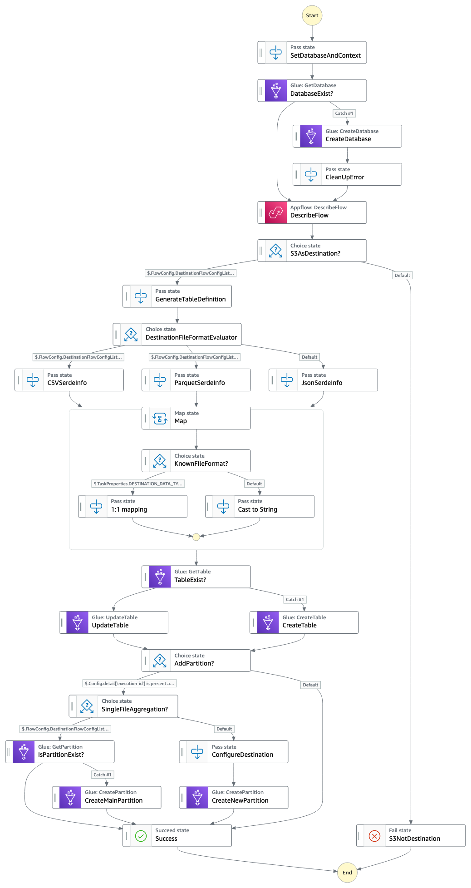

# Combining Amazon AppFlow with AWS Step Functions to maximize application integration benefits
This is a sample application that uses [AWS Step Functions](https://aws.amazon.com/step-functions/) to integrate [Amazon AppFlow](https://aws.amazon.com/appflow/) and [AWS Glue](https://aws.amazon.com/glue/) catalog without the need of writing code. It automatically uses [Amazon EventBridge](https://aws.amazon.com/eventbridge/) to trigger AWS Step Functions every time a new Amazon AppFlow flow finished running.

Important: this application uses various AWS services and there are costs associated with these services after the Free Tier usage - please see the [AWS Pricing page](https://aws.amazon.com/pricing/) for details. You are responsible for any AWS costs incurred. No warranty is implied in this example.

## Overview
An everyday use case of Amazon AppFlow is creating a customer-360 by integrating marketing, customer support, and sales data. For example, analyze the revenue impact of different marketing channels by synchronizing the revenue data from Salesforce with marketing data from Adobe Marketo. 
The Amazon AppFlow flow pushes the data to [Amazon Simple Storage Service](https://aws.amazon.com/s3/) (S3) to help access the data using standard SQL language with [Amazon Athena](https://aws.amazon.com/athena/) or using [Amazon QuickSight](https://aws.amazon.com/quicksight/) for visualizations. In this context AWS Step Functions is used to automate a workflow to help catalog the AppFlow flow data using Amazon Glue everytime a new flow runs. 

## State Machine Overview

### Prerequisites

You will need below items to successfully test and deploy:
 - [AWS CLI](https://aws.amazon.com/cli/)
 - [AWS SAM CLI](https://docs.aws.amazon.com/serverless-application-model/latest/developerguide/serverless-sam-cli-install.html)

### How to deploy
 - Use `sam deploy -guided` to start the deployment guide
    * Enter a stack name
    * Enter the desired AWS Region
    * Enter required parameters such as the AWS Glue Database Name
    * Allow SAM CLI to create IAM roles with the required permissions.
 - Note the outputs from the SAM deployment process. These contain the resource names and/or ARNs
 

### Testing
 - Create a new Amazon AppFlow flow that uses S3 as a destination
 - After the Amazon AppFlow flow finishes running, check the AWS Step Functions console for execution logs

 
### Cleanup
 - Run `sam delete --stack-name <stack-name>` to delete the stack
 - Confirm deletion
