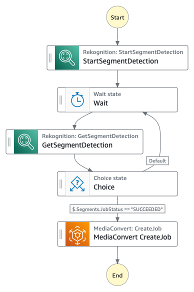
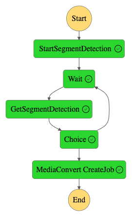

# Video Segment Detection and Edition

This workflow automates the video edition process by leveraging Amazon Rekognition for detecting segments and Amazon MediaConvert for removing segments.

Learn more about this workflow at Step Functions workflows collection: << Add the live URL here >>

Important: this application uses various AWS services and there are costs associated with these services after the Free Tier usage - please see the [AWS Pricing page](https://aws.amazon.com/pricing/) for details. You are responsible for any AWS costs incurred. No warranty is implied in this example.

## Requirements

* [Create an AWS account](https://portal.aws.amazon.com/gp/aws/developer/registration/index.html) if you do not already have one and log in. The IAM user that you use must have sufficient permissions to make necessary AWS service calls and manage AWS resources.
* [Git Installed](https://git-scm.com/book/en/v2/Getting-Started-Installing-Git)
* [AWS Serverless Application Model](https://docs.aws.amazon.com/serverless-application-model/latest/developerguide/serverless-sam-cli-install.html) (AWS SAM) installed

## Deployment Instructions

1. Create a new directory, navigate to that directory in a terminal and clone the GitHub repository:
    ``` 
    git clone https://github.com/aws-samples/step-functions-workflows-collection
    ```
1. Change directory to the pattern directory:
    ```
    cd step-functions-workflows-collection/segment-detection-workflow
    ```
1. From the command line, use AWS SAM to build and deploy the AWS resources for the workflow as specified in the template.yaml file:
    ```
    sam build
    sam deploy --guided --capabilities CAPABILITY_NAMED_IAM
    ```
1. During the prompts:
    * Enter a stack name
    * Enter the desired AWS Region (some services may only be available in **us-east-1**)
    * Allow SAM CLI to create IAM roles with the required permissions.

    Once you have run `sam deploy --guided` mode once and saved arguments to a configuration file (samconfig.toml), you can use `sam deploy` in future to use these defaults.

1. Note the outputs from the SAM deployment process. These contain the resource names and/or ARNs which are used for testing.

## How it works

This workflow automates the video edition process by leveraging Amazon Rekognition for detecting segments, and Amazon MediaConvert for removing segments. As input you will use a video file with SMPTE color bars at the beginning, and as output you will get a transcoded clean video file without SMPTE color bars.
For the input you will use a video created for the demo. Once you deploy via SAM, note the S3 bucket where you have to upload the video. The output S3 bucket should be the same.

Workflow starts by calling Amazon Rekognition for Segment Detection. The time taken for the Segment Detection Job will vary depending on the length of the video, so the workflow implements loop with Wait and Choice states. Between the Wait and Choice states, and every 60 seconds, the workflow calls the GetSegmentDetection API of Amazon Rekognition to confirm the status of the job. If the job didn't finish, the workflow stays in the loop. If the job finished, the workflow passes the segments to MediaConvert for processing.

Finally, MediaCovert received the segments as input (one of them is the SMPTE color bars at the beginning of the video), and the S3 video, to then triggering the transcoding job. During the transcoding job, MediaConvert removes the SMPTE color bars. MediaConvert CreateJob is a synchronous call following the [Run a Job (.sync)](https://docs.aws.amazon.com/step-functions/latest/dg/connect-to-resource.html#connect-sync) pattern in AWS Step Functions, which means you don't need to implement any loop to get the job status (as we did with Amazon Rekognition); Step Functions handles that with MediaConvert for you.

Note: The loop implementation for Amazon Rekognition Segment Detection Job, can be implemented differently with custom code and Lambda functions, but for simplification we use simple Wait and Choice states to maintain all low-code. Additionally, in a production environment, you should also handle failures from the Segment Detection Job.

## State Machine

<div style="text-align:center"></div>

## Testing

Once your have deployed the state machine, you should trigger it and see it in action. For that:

1. Go to the Amazon S3 console in you AWS Account.

1. Identify the S3 bucket created via SAM (look at the SAM output), and upload the video stored in the folder *./resources* of your cloned repo.

1. Go to the AWS Step Functions console in you AWS Account.

1. Identify the State Machine. You should see a state machine with a name that matches to the ARN in the output of the sam deploy command.

1.  Click on the state machine name and then click on **Start Execution** in the top-right of your screen.

1. In the following window, introduce the input of the state machine. Substitute the *bucket name* (don't use s3://). It should look like the below json.

    ```json
    {
        "Input": {
            "Bucket": "{S3 BUCKET NAME CREATED VIA SAM}",
            "Key": "source_video.mp4"
        },
        "Output": {
            "Bucket": "{S3 BUCKET NAME CREATED VIA SAM}",
            "Key": "output/"
        }
    }
    ```

1. Click on **Start Execution**

1. It will take few minutes, but once the workflow finished, you should see an image like the below.

<div style="text-align:center"></div>

1. At this point you can go to the output S3 bucket to watch the video edited, without the SMPTE color bars at the beginning.

## Cleanup
 
1. Empty the S3 bucket created via SAM
1. Delete the stack
    ```bash
    sam delete
    ```

----
Copyright 2022 Amazon.com, Inc. or its affiliates. All Rights Reserved.

SPDX-License-Identifier: MIT-0
