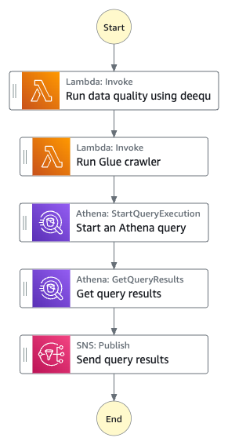

## Dataquality pipeline using deequ on AWS Lambda with AWS Step Functions
This sample application helps in demonstrating how customers can utilize AWS Step Functions and AWS Lambda to perform data quality check early in the pipeline in a cost effective way.

### Business use case
Customers often come across scenarios where they have to process large amount of small input files through a data pipeline. They also want to check early in the process that the quality of input data is good to be consumed for further transformation and massaging and then feed it to the consuming application. Running quality check often require customers to utilize big data frameworks on multiple node clusters which may not be cost effective for processing small files. This sample application helps in demonstrating how customers can utilize AWS Step Functions and AWS Lambda to perform data quality check early in the pipeline. AWS Step functions is a serverless offering that will help in orchestrating the data pipeline flow and AWS Lambda provides a lightweight serverless pay as you go compute providing cost effective alternative to customers for performing data quality checks. Customers using AWS Glue can also use [AWS Glue Data Quality](https://aws.amazon.com/blogs/big-data/getting-started-with-aws-glue-data-quality-from-the-aws-glue-data-catalog/) for doing quality check in their pipelines.

### Design and Architecture

This sample application utilizes [Deequ](https://github.com/awslabs/deequ) which is a library built on top of Apache Spark for defining "unit tests for data", which measure data quality. It also utilizes [spark-on-aws-lambda](https://github.com/aws-samples/spark-on-aws-lambda/tree/release-0.3.0) github repository (release-0.3.0) for running Deequ on top of Apache Spark using AWS Lambda.
Step Functions starts with AWS Lambda function for running Deequ on a docker container image. The AWS Glue crawler crawls on the S3 bucket containing the verification results and metrics generated by deequ in the previous step and creates the data catalogue. The Step Functions flow then performs a query using the Athena service integration and returns the results using an SNS topic. 

### Getting Started
1. The deployment of this sample application utilizes two [AWS Cloudformation](https://aws.amazon.com/cloudformation/) templates. Download both the  templates from cloudformation folder. 
1. Navigate to the CloudFormation Console. 
1. Choose *Create stack* with new resources.  
1. Upload cfn-imagebuilder.yaml file.
1. Provide a stack name. ex: deequ-image-builder. Leave rest as defaults on all pages until you reach the Submit page. 
1. Review the checkboxes at the bottom of the page. If you consent, check the boxes and click on *Submit*.
1. This will start the process building the [Amazon Elastic Container Registry](https://aws.amazon.com/ecr/) (ECR) image for Deequ. This cloudformation template uses [Amazon Codebuild](https://aws.amazon.com/codebuild/) to clone the [spark-on-aws-lambda](https://github.com/aws-samples/spark-on-aws-lambda/tree/release-0.3.0) github repository (release-0.3.0). It then builds the docker image and uploads the image to the ECR repository. 
1. After the cloudformation stack is completed, navigate to the *Outputs* tab and note down the ScriptBucket and ImageUri values to a notepad. These will be needed as an input for the next cloudformation template. 
1. Navigate to AWS CodeBuild console. Click on the Build project name to see the build progress. Ensure that the ECR image build has been completed successfully before moving to next step.
1. Once ECR image has been build, go back to Cloudformation console to create a new stack with cfn-deequ-pipeline.yaml. Please follow the similar steps as followed above.
1. Provide a stack name (ex. deequ-pipeline) and under *Inputs from deequ image builder* session, enter the value of *ImageUri* and *ScriptBucket* that you have noted down in the earlier step. Leave rest of the parameters as default and click on *Next*.
1. On the next page, leave default values and click on *Next*.
1. Scroll down to the bottom, acknowledge the *Capabilities* section and click on submit.
1. This will start creating the data quality pipeline using step function orchestration. 
1. Once the cloudformation stack has been completed successfully, go to Amazon SNS console. Under topics you should see a new topic created for your project. Ass a new Email subscription on the topic using your preferred email. It will send a notification to your email to confirm SNS subscription. Confirm the SNS subscription on your email. Please note that it may take few minutes for email to arrive.
1. Go to AWS Step Functions console. You should see a new state machine created. Go inside the state machine and start the state machine execution. Leave the default input. 
1. This will start the data quality pipeline using step functions orchestration. 

### Results
As part of step function orchestration, the first step is the data quality check where it reads a sample accommodations file. It contains list of vacation rental properties along with the id, name, host name, neighborhood, room type, price, minimum number of nights required for each property, number of reviews etc. The deequ engine performs checks like the uniqueness of the id column, completeness of the name, host name, neighborhood and price columns. It also checks that price should be non negative. At the end of the state machine, the deequ verification metric results are published to the SNS topic. If you have subscriber to this SNS topic using your email, you will receive an email with the above results in the json format.

### Playing with this sample application
This demo application is using a sample spark script sample-accommodations-to-deequ.py copied from [spark-on-aws-lambda](https://github.com/aws-samples/spark-on-aws-lambda/tree/release-0.3.0/spark-scripts) repo to SparkScript S3 bucket. You can download this file from the S3 bucket to understand how deequ verifications are performed on the input file. You can also specify your own input file by updating the INPUT_PATH environment variable on the AWS Lambda function running deequ image to your own csv input file. You can also use your own spark script by uploading your spark script on the SparkScript S3 bucket. Please note that you may have to change the memory and timeout configuration on the Lambda function depending on the size of your input file.

