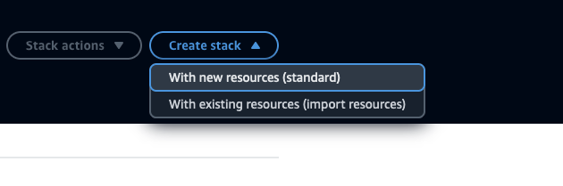
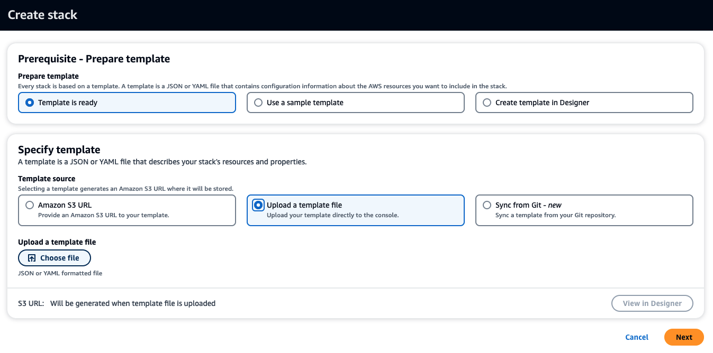
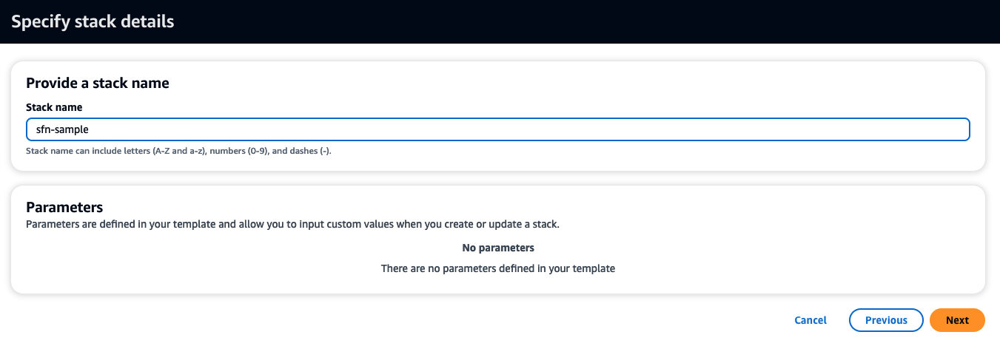

## Monte Carlo Simulations at scale with AWS Step Functions and Distributed Map

Organizations across financial services and other industries have business processes that require executing the same logic across billions of records for their machine learning and compliance needs. Many organizations rely on internal custom orchestration systems or big data frameworks to coordinate the parallel processing of their business logic across many parallel compute nodes. The maintenance and operation of orchestration systems can require significant effort from development resources or even require additional internal dedicated teams to manage these tools. Organizations also often manage large clusters of compute resources for executing business logic at scale requiring significant operational and infrastructure investments.

### Overview

### Getting Started
1. Clone the Repository

#### CloudFormation
2. Navigate to the CloudFormation [Console]('https://console.aws.amazon.com/cloudformation/home')
3. Choose Create Stack, With new resources (standard) 

4. In the Specify template section choose "Upload a template file"
5. Choose "Choose file" and navigate the directory you cloned the repository to. Navigate into the cloudformation directory and the stack you want to deploy. Choose the main.yml 

6. Provide a stack name. ex: sfn-sample 

7. Leave defaults and choose Next 

8. Review the checkboxes at the bottom of the page. If you consent, check the boxes and choose Submit 

#### Terraform
2. Navigate to the folder you closed the repository to
3. Navigate into the terraform directory and the stack you wish to deploy
4. Run "terraform init"
5. Run "terraform plan -out plan"
6. Run "terraform apply plan"