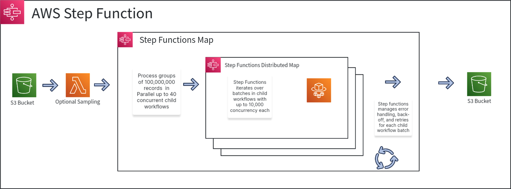

## Monte Carlo Simulations at scale with AWS Step Functions and Distributed Map

Organizations across financial services and other industries have business processes that require executing the same logic across billions of records for their machine learning and compliance needs. Many organizations rely on internal custom orchestration systems or big data frameworks to coordinate the parallel processing of their business logic across many parallel compute nodes. The maintenance and operation of orchestration systems can require significant effort from development resources or even require additional internal dedicated teams to manage these tools. Organizations also often manage large clusters of compute resources for executing business logic at scale requiring significant operational and infrastructure investments.

Blog Post: [Run Monte Carlo simulations at scale with AWS Step Functions and AWS Fargate](https://aws.amazon.com/blogs/containers/run-monte-carlo-simulations-at-scale-with-aws-step-functions-and-aws-fargate/)

### Overview

A Monte Carlo simulation is a mathematical technique that allows us to predict different outcomes for various changes to a given system. In financial portfolio analysis the technique can be used to predict likely outcomes for aggregate portfolio across a range of potential conditions such as aggregate rate of return or default rate in various market conditions.  The technique is also valuable in scenarios where your business case requires predicting the likely outcome of individual portfolio assets such detailed portfolio analysis or stress tests.

For this fictitious use case we will be working with a portfolio of personal and commercial loans owned by our company. Each loan is represented by a subset of data housed in individual S3 objects. Our company has tasked us with trying to predict which loans will default in the event of a Federal Reserve rate increase. 

Loan defaults occur when the borrower fails to repay the loan. Predicting which loans in a portfolio would default in various scenarios helps companies understand their risk and plan for future events.

### Getting Started
This repository houses three distinct samples of the same Monte Carlo Simulation, varying by compute option. When you navigate to either cloudformation or terraform folder, you find the Infrastructure as Code(IaC) templates for each sample. Folder names indicate the compute option.

- lambda - This directory contains IaC to deploy the necessary resources to run Monte Carlo simulation with AWS Lambda as compute option. The algorithm is run in AWS Lambda. [Step Functions distributed map](https://docs.aws.amazon.com/step-functions/latest/dg/use-dist-map-orchestrate-large-scale-parallel-workloads.html) manages the parallel runs of Lambda for each loan data file in Amazon S3.

- fargate - This directory contains IaC to deploy the necessary resources to run Monte Carlo simulation with Amazon ECS powered by AWS Fargate with Spot instances as compute option. The algorithm is run in Amazon ECS tasks. Step Functions distributed map uses [Step Functions activity](https://docs.aws.amazon.com/step-functions/latest/dg/concepts-activities.html) to manage the parallel runs of simulation for each loan data file in Amazon S3. To learn more about the solution architecture and design choice, check out the [blog]()

- ec2 - This directory contains IaC to deploy the the necessary resources to run Monte Carlo simulation with Amazon ECS with EC2 Spot instances as compute option. The algorithm is run in Amazon ECS tasks. Step Functions distributed map uses [Step Functions activity](https://docs.aws.amazon.com/step-functions/latest/dg/concepts-activities.html) to manage the parallel runs of simulation for each loan data file in Amazon S3.

Each stack will create two Step Functions State Machines, one to generate the data to be processed, and one to process the data and run the simulation. Which stack you deploy will depend on your workload and use case.

---

1. Clone the Repository

#### CloudFormation
2. Navigate to the CloudFormation [Console]('https://console.aws.amazon.com/cloudformation/home')
3. Choose Create Stack, With new resources (standard)
4. In the Specify template section choose "Upload a template file"
5. Choose "Choose file" and navigate the directory you cloned the repository to. Navigate into the cloudformation directory and the stack you want to deploy. Choose the main.yml
6. Provide a stack name. ex: sfn-sample
7. Leave defaults and choose Next
8. Review the checkboxes at the bottom of the page. If you consent, check the boxes and choose Submit

#### Terraform
2. Navigate to the folder you cloned the repository to
3. Navigate into the terraform directory and the stack you wish to deploy
4. Run "terraform init"
5. Run "terraform plan -out plan"
6. Run "terraform apply plan"

#### Running the Stack
The Stacks will create 2 Step Functions State Machines. You will first run the *-datagen-* workflow to generate the source data for processing. Next you will run the *-dataproc-* workflow to actually process the data.