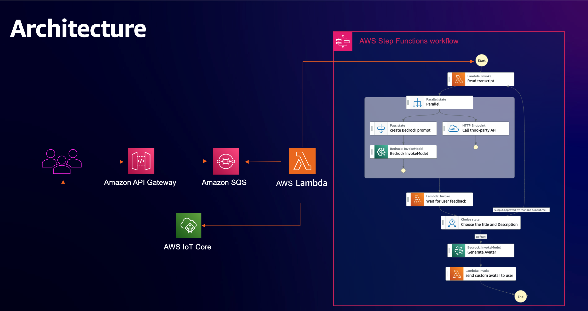

## Prompt chaining with human in the loop
This is a SAMPLE application to demonstrate prompt chaining with human in the loop. Prompt chaining is a technique of decomposing complex prompts to simpler prompts and wiring multiple simpler prompts and prompt responses as a sequence of stepts to acheive a business operation. 

### Solution overview
Conside a video streaming application such as [ServerlessVideo](https://serverlessland.com/explore/serverlessvideo). The sample application allows video authors to create title, description and custom avatar for the video using Generative AI foundation models. Steps involved are. 
1. Transcribes provided video to text.
1. Creates title and description using two foundations models - Amazon Bedrock foundation model and OpenAI model..
1. Sends the generated title and description to the video author to choose one and waits for the video author to respond
1. As the video author responds with the selected title, it uses the title to generate avatar.
1. Generates a custom avatar based on the chosen title, and sends to the vide author asGenerated avatar as pre-signed url.

Solution decomposes generation and selection of title, description and avatar to simpler prompts by first generating the title and description and then using the chosen title to generate avatar. This showcases how prompt chaining can be used with Step Functions.

### Design & Architecture



Sample application uses Step Functions direct integration with Amazon Transcribe, Amazon S3, Amazon Bedrock and HTTP API to achieve the functionality. It exposes two APIs through Amazon API Gateway - one for invoking the Step Functions to create the title, description and avatar and another to send the chosen title.
It uses Step Functions [callback token](https://docs.aws.amazon.com/step-functions/latest/dg/callback-task-sample-sqs.html) to wait for the user response.

### Demo

### Getting Started

1. One leg of the workflow uses OpenAI model to create title and description. If you do not have an OpenAI account, [create an account and get the api key](https://platform.openai.com/docs/quickstart?context=python)

1. Make sure your account is [enabled to access](https://console.aws.amazon.com/bedrock/home?#/modelaccess) Amazon Bedrock models anthropic-claude-v2 and SDXL 0.8 

1. Create EventBridge connection ARN for the apikey using aws cli. This connection is used as authorization for the openai api when invoking from Step Functions workflow. Replace {openaiKey} in the following command
```bash

aws events create-connection --cli-input-json "{ \"Name\": \"openai\", \"AuthorizationType\": \"API_KEY\", \"AuthParameters\": {\"ApiKeyAuthParameters\": { \"ApiKeyName\": \"Authorization\",  \"ApiKeyValue\": \"Bearer (openaiKey)\" } }} "

```
1. Update the cdk.context.json with connection ARN from the previous step and openai model inference endpoint.

1. Deploy the stack
```bash

cd stack/cdk
cdk deploy --all

```
### Testing locally

1. Update the following variables in [script.js](./test-local-ui/script.js)
    The values can be found in [stack exports](https://console.aws.amazon.com/cloudformation/home)

    REQ_API - value of export name -  genai-api-endpoint
    WSS_AUTHORIZER_NAME - value of export name - genai-iot-authorizer

    WSS_SERVER_URL - Access the [IoT Core console](https://console.aws.amazon.com/iot/home?#/test) and use the **Endpoint** 

2. Copy the video file

    Use the bucket name (genai-video-bucket) from the stack exports.
    ```
        aws s3 cp ../../test-local-ui/bezos-vogels.mp4 s3://{bucketname}

    ```
3. Open the [HTML page](../../test-local-ui/index.html) in browser


### Things to consider
- You must have proper authorization for API Gateway and IoT Core topic. Refer to the following guides for setting up authorization
    1. [Managing access to REST API](https://docs.aws.amazon.com/apigateway/latest/developerguide/apigateway-control-access-to-api.html)
    2. [IoT core custom authorization](https://docs.aws.amazon.com/iot/latest/developerguide/config-custom-auth.html)

- The video used in the sample is a short video. For longer videos, `Read transcript` might throw payload limit error. You must use a Lambda function.
- OpenAI API might throw too many request exception for larger payload.
- Amazon Bedrock integration with Step Functions can be configured to use S3 directly for input as well as output. 

